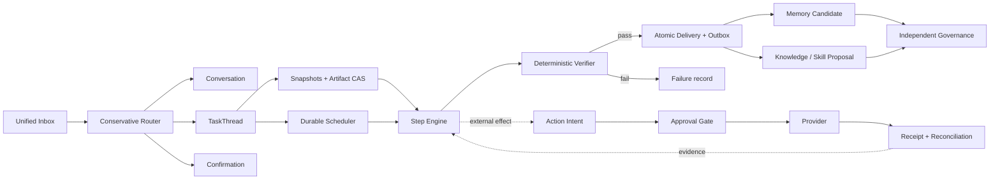

<p align="center">
  
</p>

<h1 align="center">CoPenguin</h1>

<p align="center">
  <strong>One inbox. Many isolated task threads. Work you can inspect and trust.</strong>
</p>

<p align="center">
  <a href="./README.zh.md">简体中文</a> ·
  <a href="./docs/V2_PRODUCT_ENGINEERING_DIRECTION.md">V2 Direction</a> ·
  <a href="./docs/PRODUCT_DISCOVERY.md">Product Discovery</a> ·
  <a href="./docs/RUNTIME_ARCHITECTURE.md">Runtime Architecture</a> ·
  <a href="./docs/PILOT_PROTOCOL.md">Pilot Protocol</a>
</p>

<p align="center">
  <a href="https://github.com/2sao7sao/CoPenguin/actions/workflows/ci.yml"></a>
  
  <a href="./LICENSE"></a>
  
</p>


> [!IMPORTANT]
> **Status: early Alpha.** V2-001 through V2-008 now have test-backed slices: a
> source can reach a verified, inspectable Delivery through replay-visible Steps,
> one atomic terminal transaction, and a replayable owner decision; the loopback
> Control Room makes parallel Threads, Attention, Runs, Steps, Artifacts, and
> Delivery decisions understandable without reading logs. Transactional
> channel dispatch and real Feishu publication remain separate gates. CoPenguin never
> autonomously promotes memory, skills, hooks, or permissions.

A useful personal agent should accept work through one natural chat surface without
turning every request into one tangled transcript. CoPenguin routes each message as
conversation, a new task, an update to existing work, or an ambiguity that needs the
owner's decision. Durable work receives its own `TaskThread`, causal history, snapshots,
checkpoints, approvals, artifacts, and receipts—so several life and work tasks can move
forward without silently contaminating one another.

[EvolveMemory](https://github.com/2sao7sao/EvolveMemory) supplies governed
personalization. [EvolveKB](https://github.com/2sao7sao/EvolveKB) supplies executable,
verifiable knowledge. CoPenguin remains the orchestration and policy boundary.


## The 30-Second Product Loop

```text
one inbox
  -> conservative route: chat | new task | task update | ambiguous
  -> durable TaskThread + versioned snapshots
  -> fenced worker + recoverable checkpoint
  -> replay-visible Steps + optional governed external action
  -> deterministic verifier
  -> atomic Delivery + Outbox intent
  -> accept | revise | reject | defer | take over
  -> governed learning candidates
```

The Alpha Golden Path is **Source → Inspectable Artifact**: turn an explicitly selected
source into a reviewable result, then let the owner accept, revise, reject, or publish
it. The final learning step is deliberately a candidate boundary: runtime evidence may
propose a memory, skill, hook, or permission change, but it cannot promote itself.

## Current Alpha Surface

| Surface | Current capability |
| --- | --- |
| Durable history | Append-only events, deterministic replay, projection hashes, causal IDs |
| Task isolation | Project → `TaskThread` → Run, with a single-writer rule per Thread |
| Parallel work | Durable queue, worker leases, fencing tokens, shared/exclusive resource locks |
| Recovery | Immutable Artifact CAS, frozen Run snapshots, checkpoints, Step attempts |
| Inbox decisions | Chat, new task, durable task update, control, or owner-confirmed ambiguity |
| External effects | Intent → approval → provider → Receipt, with crash reconciliation |
| Trusted closure | Deterministic verifier, versioned Delivery, five replayable owner decisions, immutable revision Runs |
| Owner control | Local loopback Control Room for parallel Threads, Attention, Runs, Steps, Artifacts, and Delivery decisions |
| Entry points | Local Control Room, CLI, Feishu webhook, and optional Feishu long connection |
| Optional intelligence | Adapters for EvolveMemory and EvolveKB |

## 5-Minute Local Path

```bash
git clone https://github.com/2sao7sao/CoPenguin.git
cd CoPenguin
python3 -m venv .venv
source .venv/bin/activate
python -m pip install -e .
copenguin demo
```

`copenguin demo` needs no Feishu account, API key, model call, or network access.
It creates an isolated local Runtime, runs two replay-visible Steps, verifies the
record, atomically prepares a Delivery and Outbox intent, prints the Artifact,
and reports the local data path. To run the engineering suite, install `.[dev]`
and execute `pytest -q`.

Start the local owner surface against the same Runtime data directory:

```bash
copenguin serve
# open http://127.0.0.1:8787/control-room
```

The V2-008 Control Room is deliberately loopback-only. It creates isolated tasks
through the durable Inbox, explains each selected Thread's Run/Step lineage, opens
digest-verified Artifact previews, and writes Delivery decisions through the
existing Runtime service. V2-010 still owns local session authentication and
scoped Artifact download authorization, so do not expose this Alpha surface beyond
loopback.

The same credential-free path works in Docker:

```bash
docker compose build
docker compose run --rm copenguin copenguin demo
docker compose up
```

After `docker compose up`, health is available at
`http://127.0.0.1:8787/healthz`.

Send one message through the local assistant boundary:

```bash
export COMPUTER_PROVIDER=dry-run
copenguin local "/computer open calendar and summarize tomorrow"
```

Local messages now enter the durable Inbox first. Supply a stable ID only when
you deliberately want to retry the same channel message:

```bash
copenguin local "/task turn these sources into a reviewable brief" \
  --project work --message-id demo-source-1
```

Run the Feishu webhook service:

```bash
export FEISHU_VERIFICATION_TOKEN="your-token"
export FEISHU_ALLOWED_OPEN_IDS="ou_xxx"
export TRUST_ALL_FEISHU_USERS_FOR_DEV=0
export COMPUTER_PROVIDER=dry-run
copenguin serve
```

Or use the authenticated long connection without a public webhook:

```bash
python -m pip install -e ".[feishu]"
export FEISHU_APP_ID="cli_xxx"
export FEISHU_APP_SECRET="..."
copenguin feishu-long-connection
```

```bash
curl http://127.0.0.1:8787/healthz
```

`dry-run` performs no desktop mutation. A bounded real provider is available on
macOS through owner-created Apple Shortcuts: set
`COMPUTER_PROVIDER=macos-shortcuts`, enable it explicitly, and list exact
Shortcut names in `MACOS_SHORTCUTS_ALLOWLIST`. Every request still enters the
durable Approval → Intent → fenced execution → Receipt boundary. Optional
Evolve integrations can be installed with `python -m pip install -e ".[evolve]"`.

## Why This Is Not Just Chat or a Task Manager

| Common approach | Missing control | CoPenguin boundary |
| --- | --- | --- |
| One chat for everything | Task identity, concurrency, recoverability | Messages are routed; durable work gets a `TaskThread` |
| A task list with status fields | Execution lineage and external-effect safety | Events, snapshots, checkpoints, intents, and receipts |
| Vector memory on every turn | Scope, provenance, correction, expiry | Governed EvolveMemory candidates and use gates |
| Retrieved documents | Executable procedures and validation | EvolveKB Playbooks, Skills, gates, and proposals |
| Autonomous self-editing | Independent evaluation and rollback | Candidate → evaluation → shadow → promotion → monitor → rollback |

## Architecture



The event journal supports multiple linked histories instead of one overloaded
transcript: conversation, execution, decisions, artifacts, and governance.
See the [runtime architecture](docs/RUNTIME_ARCHITECTURE.md) and
[state/event protocol](docs/STATE_EVENT_SPEC.md).

## Product Validation Gate

Technical correctness is not product demand. The initial hypothesis is that
AI-native individual workers juggling several projects will repeatedly delegate
real tasks, accept inspectable results, and voluntarily expand one bounded
permission.

The pilot north star is **accepted closed-loop tasks per participant per active
week**. Time in app, message count, emotional dependence, and raw autonomy level
are not success metrics. Product Evidence is a separate, consent-filtered
observation plane; it cannot mutate runtime state or promote memory, knowledge,
skills, hooks, or permissions.

- [Target segment and discovery thesis](docs/PRODUCT_DISCOVERY.md)
- [Problem interview guide](docs/INTERVIEW_GUIDE.md)
- [Four-week pilot protocol](docs/PILOT_PROTOCOL.md)
- [Product Evidence protocol](docs/PRODUCT_EVIDENCE_SPEC.md)

## V2 Direction: Trusted Closure

V2 adopts **Trusted Closure** and does not start with broader autonomy. It first
converges the legacy message path and the durable Runtime into one testable
product loop:

```text
message -> route decision -> TaskThread -> Run/Steps -> verified Delivery
        -> accept/revise/reject -> governed learning candidate
```

Read the [product and engineering review](docs/V2_PRODUCT_ENGINEERING_DIRECTION.md)
and the implementation-facing [V2 Runtime Contract](docs/V2_RUNTIME_CONTRACT.md).
The proposal includes the current problem inventory, target product surface,
Hook and self-loop boundaries, ordered PR slices, and Definition of Done.
**Source to Inspectable Artifact** is the confirmed Alpha Golden Path; this is
a product-scope decision, not yet evidence that the workflow has passed the Pilot.
The first concrete recipe is specified in the
[Feishu Memory and Knowledge System v0.1](docs/FEISHU_KNOWLEDGE_SYSTEM_SPEC_V0.1.md):
an explicitly selected Feishu source becomes a verified Project Decision Record,
then an accepted Delivery can be published to a Wiki draft through durable approval.
The first eight convergence slices have test-backed acceptance on this branch:
[V2-001 Unified Ingress](docs/V2_001_UNIFIED_INGRESS.md) provides restart-safe message
identity; [V2-002 Durable Product Approvals](docs/V2_002_DURABLE_PRODUCT_APPROVALS.md)
binds computer actions to durable Intent, Approval, claim, Artifact, and Receipt
records; [V2-003 Durable Thread Updates](docs/V2_003_DURABLE_THREAD_UPDATES.md) makes
supplements, goal changes, method Branches, cancellation, and ambiguous route decisions
durable; [V2-004 Worker Host](docs/V2_004_WORKER_HOST.md) adds bounded execution;
[V2-005 Step + Verifier](docs/V2_005_STEP_VERIFIER.md) creates causal Step and
verification evidence; [V2-006 Atomic Delivery](docs/V2_006_ATOMIC_DELIVERY.md)
closes every terminal database surface in one transaction; and
[V2-007 Delivery Decisions](docs/V2_007_DELIVERY_DECISIONS.md) persists all five
owner outcomes and creates an immutable, snapshot-bound Run for revision requests;
and [V2-008 Local Control Room](docs/V2_008_CONTROL_ROOM.md) composes those durable
projections into one responsive owner surface without creating a second source of truth.

## Stable vs Prototype

### Implemented and test-backed

- deterministic Thread/Run replay and optimistic revision checks;
- SQLite event journal plus disposable read projections;
- durable scheduling, lease fencing, resource conflicts, and checkpoint recovery;
- bounded Worker Host, Executor routing, replay-visible transform/verifier Steps,
  and deterministic DecisionRecordVerifier;
- atomic Run/Thread/scheduler/Delivery/Attention/Outbox finalization with injected
  rollback coverage;
- idempotent, replayable accept/revise/reject/defer/take-over decisions; revision
  requests atomically enqueue a new snapshot-bound Run without replacing prior work;
- responsive loopback Control Room with Project-grouped parallel Threads, a bounded
  Attention queue, per-Thread Run/Step lineage, digest-verified Artifact previews,
  and all five existing Delivery decisions;
- Feishu/local unified ingress, restart-safe inbound dedupe, normalized message
  Artifacts, and conservative persistent route decisions;
- durable Thread updates with immutable replacement snapshots/Runs, method-change
  Branch lineage, cancellation propagation, and owner-only route resolution;
- durable Action Intents, Receipts, approvals, expiry, and reconciliation;
- `/computer`, `/approve`, and `/deny` use the durable action boundary; requester-only
  policy snapshots and decision-evidence Artifacts survive restart;
- Feishu webhook and official-SDK long-connection transports, owner allowlist,
  interactive/text approval, and durable callback dedupe;
- `dry-run`, opt-in allowlisted `local-shell`, and opt-in exact-allowlist
  `macos-shortcuts` providers.

### Deliberately incomplete

- first-seen messages still pass from durable Ingress to the compatibility assistant;
  its computer gateway executes claimed Actions inline rather than through Worker Host;
- Delivery notification intent is transactional, but channel dispatch and send
  Receipt are not yet connected to the Outbox;
- the Control Room has no actor-scoped local session or independent Artifact download
  authorization yet; those remain V2-010 and binding beyond loopback stays disabled;
- Feishu long connection and cards have mocked contract coverage but still need a
  credential-backed real-app smoke test;
- broad vision-driven computer use is not shipped; the real macOS provider is
  deliberately limited to pre-existing exact-allowlist Shortcuts;
- Product Evidence is specified but not an operational validation result;
- versioned hooks, self-loop monitoring, shadow evaluation, and autonomous promotion are planned, not enabled.

## Current Commands

CLI:

- `copenguin demo [--json]`
- `copenguin serve`
- `copenguin feishu-long-connection`
- `copenguin source-task <source.json>`
- `copenguin worker --once`
- `copenguin artifact <artifact-id>`

Chat:

- `/status`
- `/remember <text>`
- `/kb <question>`
- `/computer <task>`
- `/approve <id>`
- `/deny <id>`
- `/thread <thread-id> <supplement, goal change, method change, or cancellation>`
- `/route <message-key> thread <thread-id> [supplement|goal|method|cancel]`
- `/route <message-key> new|dismiss`

## Repository Map

```text
src/super_agent_runtime/      durable events, scheduler, snapshots, inbox, actions
src/feishu_computer_agent/    current Feishu and local assistant MVP boundary
src/copenguin/                public package and CLI entry point
tests/                        runtime and channel contract tests
docs/                         architecture, governance, security, and pilot specs
assets/                       reusable CoPenguin logo and README banner
```

Local data uses `.copenguin/` by default. Existing `.agent-data/` installations
are detected for compatibility; explicit `COPENGUIN_DATA_DIR` always wins.

## Security Defaults

- no configured owner allowlist means Feishu messages are ignored;
- computer tasks require approval by default;
- `COMPUTER_PROVIDER=dry-run` performs no real action;
- `local-shell` is opt-in and only runs allowlisted executables;
- `macos-shortcuts` is opt-in and only runs exact allowlisted Shortcut names;
- encrypted Feishu webhooks are rejected in this MVP instead of being silently mishandled.

See [Security](docs/SECURITY.md) and [Feishu setup](docs/FEISHU_SETUP.md).

## Brand Assets

The primary mascot is an original chibi character in a penguin kigurumi: round
penguin hood, visible human face, wing sleeves, white belly, and yellow beak and
feet. Its forward lean, planted leading foot, lifted trailing foot, and offset
wings make the movement readable without scenery or speed lines. The mascot
follows the user-supplied visual reference without retaining its
background, watermark, character identity, or distinctive accessories. The README
banner keeps CoPenguin related to the
[EvolveKB](https://github.com/2sao7sao/EvolveKB) brand family.

- [Primary chibi penguin-suit mascot](assets/copenguin-logo.png)
- [Scalable vector mark](assets/copenguin-logo.svg)
- [README banner](assets/readme-banner.svg)
- [Asset provenance and refresh checklist](docs/assets/README.md)

Keep the standalone PNG and SVG marks when refreshing the banner.

## Contributing and release status

See [CONTRIBUTING.md](CONTRIBUTING.md), the [Code of Conduct](CODE_OF_CONDUCT.md),
[Security Policy](SECURITY.md), [Changelog](CHANGELOG.md), and the
[repository convergence record](docs/REPOSITORY_CONVERGENCE.md). The package
declares version `0.1.0`, but no release should be treated as published until the
matching Git tag and GitHub Release exist. Release steps are documented in
[docs/RELEASING.md](docs/RELEASING.md).

CoPenguin is licensed under [Apache-2.0](LICENSE).
