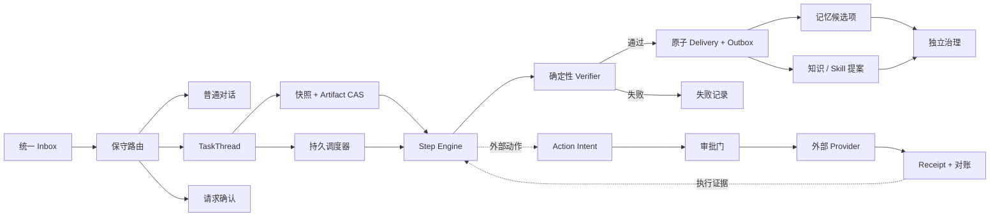

<p align="center">
  
</p>

<h1 align="center">CoPenguin</h1>

<p align="center">
  <strong>一个入口，多条隔离任务链；每份工作都可检查、可恢复、可托付。</strong>
</p>

<p align="center">
  <a href="./README.md">English</a> ·
  <a href="./docs/V2_PRODUCT_ENGINEERING_DIRECTION.md">V2 优化方向</a> ·
  <a href="./docs/PRODUCT_DISCOVERY.md">产品发现</a> ·
  <a href="./docs/RUNTIME_ARCHITECTURE.md">Runtime 架构</a> ·
  <a href="./docs/PILOT_PROTOCOL.md">试点协议</a>
</p>

<p align="center">
  <a href="https://github.com/2sao7sao/CoPenguin/actions/workflows/ci.yml"></a>
  
  <a href="./LICENSE"></a>
  
</p>


> [!IMPORTANT]
> **当前状态：早期 Alpha。** V2-001 至 V2-008 已有测试支撑：一个来源可以经过可 replay
> 的 Step、一次原子终结事务和可 replay 的主人决定，成为可信闭环 Delivery；仅限本机的
> Control Room 已把并行 Thread、Attention、Run、Step、Artifact 与 Delivery 决策转成
> 无需阅读日志也能理解和操作的界面。事务化渠道
> 发送与真实飞书发布仍是独立验收门。CoPenguin 不会自行晋升记忆、
> Skill、Hook 或权限。

真正有用的私人助理，应该允许用户只面对一个自然聊天入口，又不会把所有请求揉成一段
混乱的长对话。CoPenguin 会把每条消息判断为普通对话、新任务、已有任务更新，或需要
主人确认的歧义。需要持续执行的工作拥有独立 `TaskThread`、因果历史、快照、checkpoint、
审批、产物和回执，因此生活与工作中的多个任务可以并行推进而不相互污染。

[EvolveMemory](https://github.com/2sao7sao/EvolveMemory) 提供受治理的个性化，
[EvolveKB](https://github.com/2sao7sao/EvolveKB) 提供可执行、可验证的知识；
CoPenguin 始终保留编排权与策略边界。


## 30 秒理解产品闭环

```text
统一聊天入口
  -> 保守路由：普通对话 | 新任务 | 任务更新 | 目标不明确
  -> 持久 TaskThread + 版本化快照
  -> 带 fencing 的 Worker + 可恢复 checkpoint
  -> 可 replay Step + 可选的受治理外部动作
  -> 确定性 Verifier
  -> 原子 Delivery + Outbox 意图
  -> 接受 | 修改 | 拒绝 | 稍后 | 接管
  -> 受治理的学习候选项
```

Alpha 主路径是 **Source → Inspectable Artifact / 来源到可检查产物**：把用户明确选择的
来源转成可审查结果，再由主人接受、修改、拒绝或发布。最后一步刻意停在“候选项”：
运行证据可以提出记忆、Skill、Hook 或权限变更，但不能自行把提案升级为正式能力。

## 当前 Alpha 能力面

| 能力面 | 当前能力 |
| --- | --- |
| 持久历史 | Append-only 事件、确定性 replay、projection hash、因果 ID |
| 任务隔离 | 项目 → `TaskThread` → Run；同一 Thread 的主 Run 遵守 single-writer |
| 并发运行 | 持久队列、Worker lease、fencing token、共享/独占资源锁 |
| 恢复能力 | 不可变 Artifact CAS、Run 冻结快照、checkpoint 与 Step 尝试记录 |
| 入口判断 | 区分对话、新任务、任务更新、控制命令与需要确认的歧义 |
| 外部动作 | Intent → 审批 → Provider → Receipt，并支持崩溃对账 |
| 可信闭环 | 确定性 Verifier、版本化 Delivery、五种可 replay 决定与不可变 revision Run |
| 主人控制面 | 仅限本机的 Control Room：并行 Thread、Attention、Run、Step、Artifact 与 Delivery 决策 |
| 当前入口 | 本地 Control Room、CLI、飞书 webhook 与可选飞书长连接 |
| 可选智能层 | EvolveMemory 与 EvolveKB adapter |

## 5 分钟本地体验

```bash
git clone https://github.com/2sao7sao/CoPenguin.git
cd CoPenguin
python3 -m venv .venv
source .venv/bin/activate
python -m pip install -e .
copenguin demo
```

`copenguin demo` 不需要飞书账号、API Key、模型调用或网络。它会创建一套隔离的
本地 Runtime，执行两个可 replay Step，验证记录，在一个事务中准备 Delivery 与
Outbox 意图，打印产物和本地数据路径。开发验收可安装 `.[dev]` 后运行 `pytest -q`。

使用同一 Runtime 数据目录启动本地主人控制面：

```bash
copenguin serve
# 打开 http://127.0.0.1:8787/control-room
```

V2-008 Control Room 刻意只允许 loopback 访问。它通过耐久 Inbox 创建隔离任务，解释所选
Thread 的 Run/Step 谱系，打开经过摘要校验的 Artifact 预览，并把 Delivery 决策写回现有
Runtime service。V2-010 才会加入本地会话认证和独立 Artifact 下载授权，因此不要把当前
Alpha 控制面暴露到 loopback 之外。

同一条零凭据路径也可以通过 Docker 运行：

```bash
docker compose build
docker compose run --rm copenguin copenguin demo
docker compose up
```

`docker compose up` 后可访问 `http://127.0.0.1:8787/healthz`。

通过本地助理边界发送一条消息：

```bash
export COMPUTER_PROVIDER=dry-run
copenguin local "/computer open calendar and summarize tomorrow"
```

本地消息现在会先进入耐久 Inbox。只有在刻意重试同一条渠道消息时才需要提供稳定 ID：

```bash
copenguin local "/task 把这些来源整理成可审查简报" \
  --project work --message-id demo-source-1
```

启动飞书 webhook 服务：

```bash
export FEISHU_VERIFICATION_TOKEN="your-token"
export FEISHU_ALLOWED_OPEN_IDS="ou_xxx"
export TRUST_ALL_FEISHU_USERS_FOR_DEV=0
export COMPUTER_PROVIDER=dry-run
copenguin serve
```

也可以不暴露公网 webhook，使用经过 App 凭据认证的长连接：

```bash
python -m pip install -e ".[feishu]"
export FEISHU_APP_ID="cli_xxx"
export FEISHU_APP_SECRET="..."
copenguin feishu-long-connection
```

```bash
curl http://127.0.0.1:8787/healthz
```

`dry-run` 不会修改桌面状态。macOS 上提供一个有边界的真实 Provider：先由用户创建
Apple Shortcut，再设置 `COMPUTER_PROVIDER=macos-shortcuts`、显式开启它，并在
`MACOS_SHORTCUTS_ALLOWLIST` 中列出精确名称。所有请求仍经过持久 Approval → Intent →
fenced execution → Receipt。需要 Evolve 集成时，可执行
`python -m pip install -e ".[evolve]"`。

## 为什么不只是 Chat 或任务管理器

| 常见方案 | 缺失的控制 | CoPenguin 的边界 |
| --- | --- | --- |
| 所有事情都放在一个聊天框 | 任务身份、并发隔离、恢复 | 消息先路由，持久工作进入 `TaskThread` |
| 只有状态字段的任务列表 | 执行谱系与外部动作安全 | 事件、快照、checkpoint、Intent、Receipt |
| 每轮都写向量记忆 | 作用域、来源、更正、过期 | EvolveMemory 候选项与使用门禁 |
| 只检索文档 | 可执行流程与验证 | EvolveKB Playbook、Skill、gate、proposal |
| Agent 自己修改自己 | 独立评估与回滚 | 候选 → 评估 → 影子运行 → 晋升 → 监测 → 回滚 |

## 架构



事件日志不是一份臃肿聊天记录，而是支持多条同源历史：对话、执行、决策、产物和治理。
详见 [Runtime 架构](docs/RUNTIME_ARCHITECTURE.md) 与
[State/Event 协议](docs/STATE_EVENT_SPEC.md)。

## 产品验证门

技术正确不等于产品需求成立。当前首先验证：同时处理多个项目的 AI-native 个人工作者，
是否会反复委托真实任务、接受可检查的结果，并主动扩大一项有边界的权限。

试点北极星是**每位参与者每个活跃周被接受的闭环任务数**。使用时长、消息量、情感依赖和
粗粒度自治等级都不是成功指标。Product Evidence 是单独的、经用户同意过滤的观察面，
无权修改 Runtime，也无权晋升记忆、知识、Skill、Hook 或权限。

- [目标人群与产品发现假设](docs/PRODUCT_DISCOVERY.md)
- [问题访谈指南](docs/INTERVIEW_GUIDE.md)
- [四周试点协议](docs/PILOT_PROTOCOL.md)
- [Product Evidence 协议](docs/PRODUCT_EVIDENCE_SPEC.md)

## V2 方向：Trusted Closure / 可信闭环

V2 已确认采用 **Trusted Closure / 可信闭环**，不以扩大自治为起点，而是先把旧消息入口与
耐久 Runtime 收敛成一条可验证的产品主链：

```text
消息 -> 路由决定 -> TaskThread -> Run/Steps -> 经验证的 Delivery
     -> 接受/修改/拒绝 -> 受治理的学习候选项
```

详见 [产品与工程审计及 V2 方向](docs/V2_PRODUCT_ENGINEERING_DIRECTION.md) 和面向实现的
[V2 Runtime Contract](docs/V2_RUNTIME_CONTRACT.md)。其中包括当前问题清单、产品控制面、
Hook/self-loop 边界、按顺序拆分的 PR 与 Definition of Done。
**Source to Inspectable Artifact** 已确认为 Alpha 主路径；这是产品范围决定，不代表该工作流
已经通过用户 Pilot 验证。
第一条具体配方记录在
[飞书记忆与知识系统 v0.1](docs/FEISHU_KNOWLEDGE_SYSTEM_SPEC_V0.1.md)：
把用户明确选择的飞书来源转成经过验证的项目决策记录，再通过持久审批把已接受的 Delivery
发布为 Wiki 草稿。

前八个收敛切片已在当前分支通过测试级验收：
[V2-001 统一 Ingress](docs/V2_001_UNIFIED_INGRESS.md) 提供跨重启的消息身份；
[V2-002 持久产品审批](docs/V2_002_DURABLE_PRODUCT_APPROVALS.md) 把 computer action 绑定到
持久 Intent、Approval、claim、Artifact 与 Receipt；
[V2-003 持久 Thread 更新](docs/V2_003_DURABLE_THREAD_UPDATES.md) 让补充信息、目标变更、
方法 Branch、取消和歧义路由决定全部耐久化；
[V2-004 Worker Host](docs/V2_004_WORKER_HOST.md) 增加有界执行；
[V2-005 Step + Verifier](docs/V2_005_STEP_VERIFIER.md) 记录 Step 因果链与验证证据；
[V2-006 原子 Delivery](docs/V2_006_ATOMIC_DELIVERY.md) 在同一事务关闭全部数据库终态；
[V2-007 Delivery 决定](docs/V2_007_DELIVERY_DECISIONS.md) 持久化五种主人决定，并为修改请求
原子创建绑定新快照的不可变 Run；
[V2-008 本地 Control Room](docs/V2_008_CONTROL_ROOM.md) 则把这些耐久 projection 组合成
响应式主人界面，同时不创建第二套事实来源。

## 稳定能力与原型边界

### 已实现并有测试支撑

- Thread/Run 确定性 replay 与 optimistic revision check；
- SQLite event journal 和可丢弃重建的只读 projection；
- 持久调度、lease fencing、资源冲突与 checkpoint 恢复；
- 有界 Worker Host、Executor 路由、可 replay 的 transform/verifier Step 与确定性
  DecisionRecordVerifier；
- Run/Thread/scheduler/Delivery/Attention/Outbox 原子终结，并覆盖故障注入回滚；
- accept/revise/reject/defer/take-over 决定可幂等、可 replay；修改请求原子排队新的
  snapshot-bound Run，同时保留全部旧工作；
- 响应式 loopback Control Room：按 Project 分组的并行 Thread、有界 Attention 队列、
  单 Thread Run/Step 谱系、摘要校验 Artifact 预览与已有五种 Delivery 决策；
- 飞书/本地统一 Ingress、跨重启入站去重、规范化消息 Artifact 与持久保守路由；
- 持久 Thread 更新、不可变 replacement snapshot/Run、方法 Branch 谱系、取消传播与
  仅限 owner 的路由决定；
- 持久 Action Intent、Receipt、审批、过期与对账；
- `/computer`、`/approve` 和 `/deny` 已经过持久动作边界；请求者策略快照和决定证据
  Artifact 可跨重启保留；
- 飞书 webhook 与官方 SDK 长连接、owner allowlist、交互卡片/文字审批和 callback 去重；
- `dry-run`、显式开启的 allowlisted `local-shell` 与精确名称 allowlist 的
  `macos-shortcuts`。

### 刻意尚未完成

- 首次接收的消息仍会从耐久 Ingress 进入兼容助理；computer gateway 仍内联执行已
  claim 的 Action，而不是交给 Worker Host；
- Delivery 通知意图已事务化，但渠道 dispatcher 与发送 Receipt 尚未接入 Outbox；
- Control Room 尚无 actor-scoped 本地会话和独立 Artifact 下载授权；这些仍属于 V2-010，
  且 loopback 之外的绑定保持关闭；
- 飞书长连接和卡片已有 mock 契约测试，但仍需真实凭据与已发布 App 的 smoke test；
- 广义视觉 computer-use 尚未交付；真实 macOS Provider 刻意只允许预先创建、精确
  allowlist 的 Shortcuts；
- Product Evidence 目前是协议，不是已经得出的市场验证结论；
- 版本化 Hook、self-loop 监测、影子评估和自治晋升仍在规划中，默认没有启用。

## 当前命令

CLI：

- `copenguin demo [--json]`
- `copenguin serve`
- `copenguin feishu-long-connection`
- `copenguin source-task <source.json>`
- `copenguin worker --once`
- `copenguin artifact <artifact-id>`

聊天命令：

- `/status`
- `/remember <text>`
- `/kb <question>`
- `/computer <task>`
- `/approve <id>`
- `/deny <id>`
- `/thread <thread-id> <补充、目标变更、方法变更或取消>`
- `/route <message-key> thread <thread-id> [supplement|goal|method|cancel]`
- `/route <message-key> new|dismiss`

## 仓库结构

```text
src/super_agent_runtime/      持久事件、调度、快照、Inbox、动作治理
src/feishu_computer_agent/    当前飞书与本地助理 MVP 边界
src/copenguin/                公共 Python package 与 CLI 入口
tests/                        Runtime 与消息渠道契约测试
docs/                         架构、治理、安全和产品试点协议
assets/                       可复用的 CoPenguin Logo 与 README Banner
```

本地数据默认存储在 `.copenguin/`。为了兼容已有安装，会自动发现 `.agent-data/`；
显式设置的 `COPENGUIN_DATA_DIR` 始终优先。

## 安全默认值

- 未配置 owner allowlist 时，飞书消息会被忽略；
- computer task 默认需要审批；
- `COMPUTER_PROVIDER=dry-run` 不执行真实动作；
- `local-shell` 必须显式开启，并且只能运行 allowlist 中的可执行程序；
- `macos-shortcuts` 必须显式开启，并且只能运行精确 allowlist 的 Shortcut；
- 当前 MVP 会拒绝加密飞书 webhook，不会静默误处理。

详见 [安全说明](docs/SECURITY.md) 和 [飞书配置](docs/FEISHU_SETUP.md)。

## 品牌素材

主要吉祥物是一个原创的“人物穿企鹅连体服”Q 版角色：圆形企鹅帽、外露人脸、短翼袖、
白肚皮以及黄色喙和脚。身体前倾、前脚承重、后脚抬起、双翼错开的姿态，让动作无需背景
或速度线也能读成向前滑行。它遵循用户提供参考图的明确方向，但不保留原图背景、水印、
人物身份或标志性配饰；README Banner 则继续与
[EvolveKB](https://github.com/2sao7sao/EvolveKB) 保持同一品牌家族。

- [主要企鹅连体服 Q 版吉祥物](assets/copenguin-logo.png)
- [可缩放矢量 Logo](assets/copenguin-logo.svg)
- [README Banner](assets/readme-banner.svg)
- [素材来源与更新检查表](docs/assets/README.md)

以后即使重做 Banner，也要保留独立 PNG 与 SVG Logo。

## 贡献与发布状态

请阅读 [贡献指南](CONTRIBUTING.md)、[行为准则](CODE_OF_CONDUCT.md)、
[安全政策](SECURITY.md)、[变更日志](CHANGELOG.md) 与
[仓库收敛记录](docs/REPOSITORY_CONVERGENCE.md)。当前 package 声明版本为 `0.1.0`，
但只有匹配的 Git tag 和 GitHub Release 确实存在时，才能视为已经发布；流程见
[docs/RELEASING.md](docs/RELEASING.md)。

CoPenguin 采用 [Apache-2.0](LICENSE) 开源协议。
