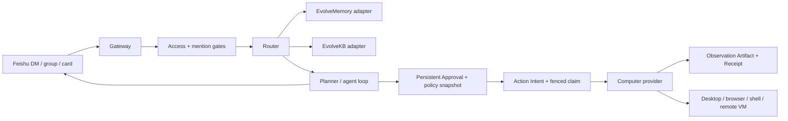

# Architecture

## Target Shape

The gateway is now backed by a separate durable execution core. See
[`RUNTIME_ARCHITECTURE.md`](RUNTIME_ARCHITECTURE.md) and
[`STATE_EVENT_SPEC.md`](STATE_EVENT_SPEC.md). Feishu remains an input/output
channel; it is not the owner of Thread state or execution history.

## Borrowed Patterns

Hermes Agent contributes the product shape: a messaging gateway that can route work into an agent loop, expose skills, keep memory, and require approvals for sensitive operations.

OpenClaw contributes the local-first gateway stance: Feishu is a control plane, not the agent itself. DM/group access policy, per-sender routing, and dynamic workspace isolation should remain explicit.

EvolveKB should own operational knowledge:

- recurring workflows,
- Feishu/office procedures,
- personal operating playbooks,
- runbooks that need validation gates and reviewable evolution.

EvolveMemory should own user memory:

- preferences,
- personal facts,
- active events,
- correction and forgetting,
- whether a memory can be used directly, as style, as follow-up, or not at all.

## Runtime Boundaries

`feishu.py`

- verifies Feishu token,
- parses URL verification and message events,
- sends text replies through Feishu REST.

`agent.py`

- parses commands,
- stores explicit/user turns in memory,
- calls EvolveKB for `/kb`,
- delegates `/computer`, `/approve`, and `/deny` to the durable action gateway.

`action_gateway.py`

- binds the durable Inbox message to its TaskThread and Run,
- creates immutable request and policy Artifacts,
- creates Action Intent and persistent Approval,
- authorizes the requester-only decision,
- claims Provider execution and records an observation Artifact and Receipt,
- returns uncertain Provider outcomes as `RECONCILE_REQUIRED`.

`security.py`

- owner allowlist,
- compatibility risk classification.

`computer.py`

- provider interface,
- safe dry-run implementation,
- opt-in local shell implementation.

`super_agent_runtime`

- append-only Event Journal and disposable Thread projections,
- deterministic Thread/Run state reducer,
- durable parallel scheduler with worker fencing,
- resource leases for cross-Thread conflict control.

## Why Provider First

The dangerous part of this product is not Feishu messaging; it is turning chat text into host computer actions. The computer-use layer is therefore a narrow provider interface. Real providers should produce observations and audit events, not mutate agent state invisibly.
