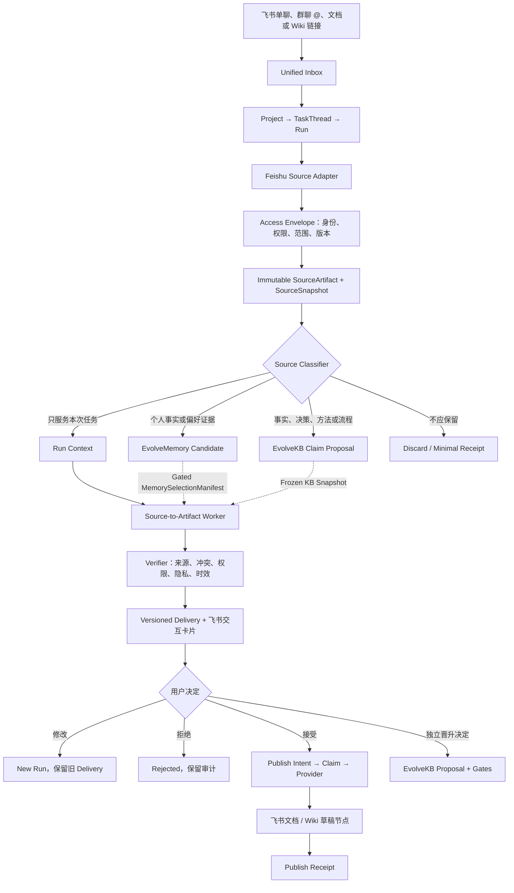

# CoPenguin 飞书记忆与知识系统规格 v0.1

状态：Specified，等待 V2-002 → V2-007 主链逐步实现

日期：2026-08-13

关联决策：**Trusted Closure**、**Source to Inspectable Artifact**、本地优先、分级进化

首个 Alpha 工作流：**飞书来源 → 项目决策记录 → 用户决定 → 飞书知识空间草稿**

## 0. 结论

飞书不是 CoPenguin 的记忆数据库，也不是 Runtime 的事实来源。飞书在这套系统里承担三个角色：

1. **Capture Surface**：用户通过单聊、群聊 `@`、消息话题、文档或 Wiki 链接提供来源；
2. **Review Surface**：通过消息卡片确认范围、审阅交付、纠正记忆候选和批准发布；
3. **Publish Surface**：把已接受的 Artifact 发布为面向人的文档或知识空间节点。

系统内部必须保留四个不同的权威边界：

| 层级 | 内容 | 权威系统 | 不允许承担的职责 |
| --- | --- | --- | --- |
| Runtime State | TaskThread、Run、Step、Approval、Delivery、Receipt | CoPenguin | 不充当长期用户画像 |
| Private Memory | 用户事实、偏好、关系、事件、负向偏好、假设 | EvolveMemory | 不保存任务队列或组织知识库 |
| Reusable Knowledge | 证据、Claim、决策、方法、SOP、Playbook、Skill | EvolveKB | 不保存未经治理的个人记忆 |
| Published Artifact | 决策记录、简报、SOP、FAQ、项目手册 | 飞书文档 / Wiki | 不成为唯一可 replay 状态 |

最重要的系统不变量是：

```text
相关信息 != 可以使用的记忆
重复出现 != 已经证实的画像
接受交付 != 同意写入私人记忆
发布飞书文档 != 晋升 EvolveKB
检索成功 != 获得使用权限
```

## 1. 范围与非目标

### 1.1 v0.1 范围

- 飞书单聊消息、群聊中明确 `@` 的消息、指定消息话题；
- 用户明确提交的飞书新版文档或 Wiki 节点链接；
- 来源权限、版本、内容 hash 和采集身份的快照；
- 从来源生成一份可检查的项目决策记录；
- 飞书卡片上的 `接受 / 修改 / 拒绝 / 稍后 / 接管`；
- 接受后通过 durable Approval 发布到指定知识空间草稿目录；
- 单独产生 EvolveKB Proposal；默认不改变 EvolveMemory。

### 1.2 明确非目标

- 不同步整个企业知识库；
- 不监听没有 `@` 或明确授权的群聊环境消息；
- 不把所有对话自动写入长期记忆；
- 不自动推断并固化性格、能力、健康、财务等敏感画像；
- 不在 V2 自动晋升知识、Skill、Hook 或权限；
- 不以向量相似度代替权限、证据、时效和范围判断；
- 不在缺少加密存储与删除 Receipt 时采集 `restricted` 来源；
- 不承诺双向实时同步；v0.1 采用显式 capture 和 revision 检查。

## 2. 当前实现事实与迁移目标

当前 `feishu_computer_agent` 仍使用较简化的 adapter：

- 普通聊天调用 `ingest_turn(session_id=platform:actor, ...)`；
- `/remember` 也调用同一写入接口，并直接报告 accepted 数量；
- `/kb` 只提供 `answer_with_evidence` 查询；
- CoPenguin 尚未暴露记忆候选审阅、纠正、忘记、scope 或使用清单；
- CoPenguin 尚未把飞书来源编译成 EvolveKB Claim / Proposal；
- Import 或仓库缺失时 adapter 会退化为 no-op，产品路径无法区分“没有结果”和“能力不可用”。

迁移目标不是简单增加更多 adapter 方法，而是把语义改为：

```text
observe -> candidate -> review/govern -> active -> select/use -> audit
```

以及：

```text
source -> immutable snapshot -> claims -> usage asset -> proposal -> gates
```

## 3. 总体架构



任何飞书写入都必须经过 `Intent -> Claim -> provider -> Receipt`。卡片点击不是直接调用飞书
写接口的授权；它首先产生 durable 用户决定或 Approval 事件。

## 4. 飞书作为 Capture Surface

### 4.1 支持的入口

| 入口 | Alpha 行为 | 默认范围 |
| --- | --- | --- |
| 单聊文本 | 路由为普通对话、新任务、任务更新或确认 | actor + selected project |
| 群聊 `@` | 只采集触发消息和明确选择的话题消息 | chat + project |
| 文档链接 | 读取用户明确提交的文档 revision | selected project |
| Wiki 链接 | 解析 node 到真实文档 token，再固定 revision | selected project |
| 消息卡片 | 收集 scope、产物类型、接受/修改/拒绝和发布批准 | 对应 TaskThread |

禁止把“机器人在群里”解释成对全部历史消息的采集许可。

### 4.2 Capture Card

当来源、目标或权限存在歧义时，CoPenguin 返回 Capture Card，最少显示：

- 将读取的消息、话题、文档或 Wiki 节点；
- 来源当前所有者和可见范围的摘要；
- 目标 Project；
- 期望 Artifact 类型；
- 本地保留级别和建议保留期限；
- 是否允许提出 Memory Candidate；
- 预期发布位置；
- `确认采集 / 调整 / 取消`。

卡片回调只记录用户选择；超过回调处理预算的工作进入 Worker，不在回调请求内执行。

## 5. 来源、权限与版本模型

### 5.1 FeishuSourceRef

```text
source_ref_id
tenant_key_hash
container_type: message | thread | docx | wiki
message_id | root_id | document_id | node_id | obj_token
actor_ref
chat_ref
auth_principal: app | user
revision_id
content_hash
captured_at
```

本地日志不保存 access token，也不保存不需要的真实 tenant key。外部 ID 在不影响 Provider 调用的
地方应使用本地映射或 keyed hash。

### 5.2 AccessEnvelope

```text
access_envelope_id
source_ref_id
credential_kind
granted_scopes
authorization_basis
source_owner_ref
effective_access: read | edit | manage
audience_fingerprint
sensitivity
checked_at
expires_at
```

`AccessEnvelope` 记录“当时为什么允许读或写”，但不是永久授权。开始采集、重新验证和发布前都要
检查实际权限。

### 5.3 SourceSnapshot

```text
source_snapshot_id
source_ref_id
revision_id
artifact_id
content_hash
access_envelope_id
extractor_version
normalizer_version
captured_at
retention_class
```

Worker 只能读取绑定到 Run ContextSnapshot 的 `SourceSnapshot`。若远端 revision 在执行过程中改变，
当前 Run 可以完成，但 Delivery 必须标记 `source_changed`；在重新采集前禁止发布为 active knowledge。

### 5.4 发布范围

Artifact 的发布受众不得宽于全部来源授权范围的安全交集：

```text
publish_audience <= safe_intersection(source_access_envelopes)
```

若无法可靠计算安全交集，Alpha 默认只向发起用户交付，并要求用户为更广发布范围单独批准。

## 6. 信息分类与所有权

每个来源片段只能被分类为以下一个或多个用途，分类结果本身必须可追踪：

| 分类 | 去向 | 默认行为 |
| --- | --- | --- |
| `runtime_context` | 当前 Run | Run 结束后按 Artifact retention 管理 |
| `memory_evidence` | EvolveMemory Candidate | 不直接成为 Active Memory |
| `knowledge_evidence` | EvolveKB Claim Proposal | 不直接写 active KB |
| `artifact_only` | Published Artifact | 不进入 Memory / KB |
| `discard` | 最小审计 Receipt | 不保存原文 |

同一片段可以同时成为当前 Run Context 与 Knowledge Evidence，但必须生成两个不同用途的引用。

## 7. 记忆系统契约

### 7.1 规范化 Memory Claim

工作与生活通用性不通过两套独立数据库实现，而通过统一 Claim 加 facet 和 projection 实现：

```text
memory_id
kind: profile_fact | preference | relationship | event | commitment
      | workflow_evidence | hypothesis | negative_preference
subject: user | person | project | domain | thread
scope: global | domain | project | thread
epistemic_state: observed | inferred_candidate | user_confirmed
                 | corrected | rejected | expired
authority: user_explicit | user_implicit | assistant_inferred | external_source
sensitivity: public | personal | sensitive | restricted
allowed_use: direct | style | follow_up | hidden_constraint | review_only | prohibited
evidence_refs
confidence
valid_from / valid_until
status / version / supersedes
```

用户画像是这些 Claim 的有版本 projection，不是可以被整体覆盖的一份自由文本档案。

### 7.2 写入策略

| 触发 | 允许产生的结果 | 禁止行为 |
| --- | --- | --- |
| 普通对话 | Observation / MemoryEvidence | 自动 Active |
| “记住这条” | 显式 Candidate；低敏感且 scope 清晰时可确认激活 | 默认 global |
| 共享文档或群聊 | `external_source`、project scope Candidate | 直接成为私人画像 |
| 重复纠正 | WorkflowEvidence；独立任务证据达到门槛后形成 Hypothesis | 把重复次数当事实 |
| 接受 Delivery | 可提出 Knowledge / Workflow Candidate | 推断用户同意记忆 |
| “忘记/这不对” | suppress、supersede 或 delete 请求及 Receipt | 只从 prompt 隐藏但继续使用 |

`restricted`、跨域 global、健康、财务、身份、亲密关系等高影响 Claim 必须显式审阅；Alpha 不允许
assistant inference 自动激活。

### 7.3 待推理画像

待推理画像使用 `Hypothesis`，至少包含：

- 支持证据；
- 反证；
- 独立来源或独立 TaskThread 数量；
- 适用 domain / project；
- 最后观测时间；
- 下一次需要询问用户的问题；
- 允许用途，默认 `review_only`。

最低门槛是来自至少两个独立任务的证据；达到门槛只意味着“可以提出确认”，不意味着自动证实。

### 7.4 使用策略

Runtime 不能获取任意 MemoryRecord，只能接收冻结的 `MemorySelectionManifest`：

```text
selection_id
memory_policy_snapshot_id
query_scope
selected_items:
  memory_id
  version
  allowed_use
  reason
  evidence_summary
excluded_count_by_reason
created_at
```

每个 Run 必须能够回答：使用了哪条记忆、为什么允许使用、属于哪个 scope、哪个版本，以及用户纠正后
哪些 Delivery 可能受影响。

## 8. 知识系统契约

EvolveKB 管理的是可复用、可验证的知识和执行方法，不是聊天记录集合。飞书来源进入 EvolveKB 的路径为：

```text
SourceSnapshot
  -> SourceChunk
  -> grounded Claim
  -> typed KnowledgeBlock
  -> UsageAsset
  -> Playbook / Skill Proposal
  -> gates and regression evals
  -> reviewed active version
```

### 8.1 Knowledge Claim

每条 Claim 至少包含：

- 原子化陈述；
- 逐条 source reference；
- 证据片段及位置；
- claim type；
- confidence；
- validity window；
- `active / conflicting / superseded / rejected`；
- 允许的使用场景和禁止场景。

### 8.2 知识晋升门槛

Artifact 被用户接受后，只能创建 `KnowledgeProposal`。Proposal 至少通过：

1. 来源可访问且 revision 未漂移；
2. 关键陈述有 evidence coverage；
3. 引用能定位到 SourceSnapshot；
4. 冲突 Claim 被显示而不是静默合并；
5. 没有越权传播敏感内容；
6. 有明确 usage intent、trigger 和 anti-trigger；
7. 变更以 diff 表示，可拒绝和回滚；
8. 若升级为 Playbook / Skill，有独立 eval 或 shadow evidence。

发布飞书文档与通过 EvolveKB gates 是两个独立终态。

## 9. 首个 Artifact：Project Decision Record

### 9.1 输入

- 一段明确选择的飞书消息或话题；或
- 一份飞书文档 / Wiki 节点；或
- 上述两者的小规模组合；
- 用户命令：“把这些沉淀成项目决策记录”。

Alpha 不允许无边界的“把这个群所有历史都总结了”。

### 9.2 产物结构

```text
title
artifact_type: project_decision_record
project_id
audience
purpose
source_snapshot_ids

1. 背景与问题
2. 已确认事实
3. 决策
4. 决策理由与备选方案
5. 行动项：owner / due / status
6. 未决问题与风险
7. 来源与逐条引用
8. 有效范围、版本与下次复核时间
```

模型无法从来源确认的信息必须放入“未决问题”，不得填充成事实。

### 9.3 可用内容质量门槛

`DecisionRecordVerifier v1` 输出一个版本化 VerifierResult，至少检查：

- `source_coverage`：关键事实和决策理由是否有来源；
- `citation_resolvability`：引用能否解析到固定 snapshot；
- `unsupported_claims`：是否存在来源不支持的事实；
- `contradictions`：来源间冲突是否显式展示；
- `permission_safety`：交付和发布受众是否安全；
- `sensitivity_leakage`：是否出现不应发布的信息；
- `freshness`：来源 revision 是否改变；
- `actionability`：行动项是否明确 owner、next action；
- `format_contract`：必需段落和 metadata 是否完整。

Verifier 不能把失败结果改写为通过。失败时 Delivery 可以作为 draft 交付，但不得进入 publish-ready 状态。

## 10. 工作流状态机

```text
CAPTURE_REQUESTED
  -> ACCESS_VERIFIED
  -> SNAPSHOTTED
  -> CLASSIFIED
  -> DRAFTING
  -> VERIFYING
  -> DELIVERED
  -> ACCEPTED | REVISION_REQUESTED | REJECTED | DEFERRED | TAKEN_OVER
  -> PUBLISH_APPROVAL_PENDING
  -> PUBLISH_CLAIMED
  -> PUBLISHED
```

异常分支：

- 无权读取：`ACCESS_DENIED`；不保存远端正文；
- 来源改变：`SOURCE_STALE`；允许重新采集后创建新 Run；
- 用户要求修改：保留旧 Run / Delivery，创建新 Run；
- 发布超时且外部结果未知：`RECONCILE_REQUIRED`；禁止盲目重试；
- 用户拒绝：`REJECTED`；保留决定和最小审计，不晋升；
- 用户接管：停止 Worker lease，保留已有 Artifact 和 checkpoint。

## 11. 外部写入与 Receipt

发布 Intent 至少包含：

```text
intent_id
run_id
delivery_id
artifact_id
target_space_id
target_parent_node_id
requested_audience
source_access_envelope_ids
idempotency_key
approval_id
```

Provider Receipt 至少包含：

```text
provider_operation_id
document_id
wiki_node_id
published_revision_id
published_content_hash
effective_audience
provider_timestamp
request_fingerprint
status
```

同一个 `idempotency_key` 不得创建两份文档。若飞书返回超时，reconciler 必须先按 operation metadata、
目标父节点和内容 hash 检查是否已创建，再决定重试。

## 12. Durable Events

建议增加或复用以下事件：

```text
source.capture_requested
source.access_verified
source.access_denied
source.snapshot_recorded
source.revision_changed
source.classified

memory.observation_recorded
memory.candidate_proposed
memory.candidate_reviewed
memory.corrected
memory.forget_requested
memory.selection_manifest_bound

knowledge.claims_compiled
knowledge.proposal_created
knowledge.proposal_reviewed

delivery.recorded
delivery.decision_recorded
publish.intent_created
publish.claim_acquired
publish.receipt_recorded
publish.reconciliation_required
```

所有 projector 必须可由事件日志重建；飞书卡片内容和 Wiki 页面不是 projection 的唯一来源。

## 13. 与 V2-002 → V2-011 的实现绑定

| Slice | 本规格中的责任 | 验收增量 |
| --- | --- | --- |
| V2-002 ✅ | 移除产品路径内存审批 | 飞书发布动作只能引用 durable Approval；重启后仍可 approve/deny |
| V2-003 ✅ | Thread update / confirmation | 补充来源、改 Artifact 类型、换发布位置、取消都有持久语义 |
| V2-004 ✅ | Worker Host / Executor | `SourceSnapshot -> Project Decision Record draft` 可从 queue 自动完成 |
| V2-005 ✅ | Step / Verifier | transform、verify 分 Step；VerifierResult 版本化并保留 causal trace |
| V2-006 ✅ | atomic finalize | Run、Delivery、Attention、Outbox 不出现分裂终态 |
| V2-007 | Delivery decision | 飞书卡片的 accept/revise/reject/defer/takeover 可 replay；revise 创建新 Run |
| V2-008/009 | Control Room | 可查看来源、权限、引用、版本、决定、发布 Receipt |
| V2-011 | Memory Scope Contract | Candidate 可审阅；Run 显示 MemorySelectionManifest；支持纠正和忘记 |

V2-002 至 V2-006 已完成收敛分支的测试级验收；这只建立统一入口、有界执行、确定性
Verifier 与原子 Delivery/Outbox，不授权真实飞书 Wiki 写入。当前 V2-004/005 使用可重复的
deterministic fixture 与 Verifier。真实发布仍需 V2-007 Delivery 决定、durable Approval、
Outbox dispatcher 和发送 Receipt。

## 14. 端到端验收场景

1. 同一飞书消息重试和进程重启后只产生一个 Capture Task；
2. 用户无权读取的文档不会在本地留下正文 Artifact；
3. 文档 revision 改变后旧 Delivery 显示 stale，不能静默发布；
4. 群聊来源默认不产生 Active Private Memory；
5. 普通对话只产生 Observation，不直接激活记忆；
6. “记住”但 scope 不清楚时出现确认卡片；
7. Hypothesis 未经确认不会以 direct fact 注入 prompt；
8. Verifier 能定位 unsupported claim 和不可解析引用；
9. accept 后发布需要 durable Approval，重启不丢失；
10. 同一 publish idempotency key 不会创建重复 Wiki 节点；
11. Provider 超时且结果未知时进入 reconciliation，而不是直接重试；
12. revise 保留旧 Delivery 并创建新 Run；
13. reject 不产生 KB promotion；
14. 用户纠正记忆后，新 Run 不再选择旧版本；
15. 发布受众扩大必须单独批准，且不得突破来源安全范围；
16. 从事件日志 replay 后 Task、Delivery、Approval、Receipt projection hash 一致。

## 15. Alpha 产品证据

Alpha 验证的是“是否产生可复用、可信任的内容”，不是聊天时长或打开次数。

主要指标：

- `accepted_verified_artifacts / submitted_capture_tasks`；
- 用户接受前的 revision 次数和修改类型；
- 关键 Claim citation coverage；
- Artifact 在 7/28 天内被实际引用、更新或复用的比例；
- 从提交到可接受 Delivery 的用户等待时间；
- 权限、敏感信息、重复发布和 stale-source 事故数；
- 用户主动扩大授权范围的比例及其对应成功任务证据。

护栏：

- 不以消息数、停留时长、连续签到或情绪依赖衡量成功；
- Product Evidence 事件需要 consent、最小化、可导出和可删除；
- Product Evidence 不得写 Runtime 状态或晋升 Memory / KB。

## 16. 后续开放决策

以下问题不阻塞规格落地，但必须在对应实现 slice 前定案：

1. Alpha 首批只支持单文档，还是允许“一个话题 + 一个文档”的受限组合；
2. Wiki 草稿目录由用户固定配置，还是每次在 Capture Card 选择；
3. `personal` SourceArtifact 的默认保留期限；
4. 加密 Artifact store 上线前是否完全禁用 sensitive capture；
5. 飞书文档变更采用显式重新验证，还是在后续版本订阅文档事件；
6. 项目决策记录之后的第二个 Artifact Recipe 是 SOP 还是 Research Brief。

本规格默认选择：**先单文档或单话题、固定草稿目录、显式重新验证、restricted 禁止采集、SOP
作为第二种 Recipe**。

## 17. 飞书官方能力依据

以下能力在 2026-08-13 通过飞书开放平台官方文档核对：

- [接收消息事件](https://open.feishu.cn/document/server-docs/im-v1/message/events/receive?lang=zh-CN)
- [回复消息](https://open.feishu.cn/document/server-docs/im-v1/message/reply?lang=zh-CN)
- [卡片回传交互](https://open.feishu.cn/document/uAjLw4CM/ukzMukzMukzM/feishu-cards/handle-card-callbacks?lang=zh-CN)
- [新版文档与块 API](https://open.feishu.cn/document/server-docs/docs/docs/docx-v1/docx-overview)
- [创建知识空间节点](https://open.feishu.cn/document/ukTMukTMukTM/uUDN04SN0QjL1QDN/wiki-v2/space-node/create)
- [搜索 Wiki](https://open.feishu.cn/document/server-docs/docs/wiki-v2/search_wiki)
- [云文档权限概述](https://open.feishu.cn/document/server-docs/docs/permission/overview)

这些 API 证明飞书可以承担入口、审阅和发布界面；它们不证明 CoPenguin 已经实现了这条链路，也不
改变本规格中的本地权威状态、审批、Receipt 和记忆治理要求。
