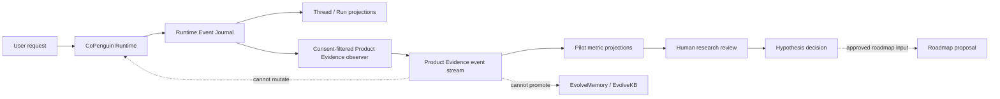

# Product Evidence Event Protocol v0.1

Status: specification only; not yet implemented

Owner: CoPenguin product validation plane

## Purpose

This protocol measures whether CoPenguin delivers repeated, accepted outcomes
and earns bounded trust. It must not become a surveillance system, a second
memory store, or an optimization loop for compulsive engagement.

Runtime truth and product evidence are related but have different authority:



Product evidence may inform a reviewed roadmap proposal. It cannot directly
change a prompt, route, memory, skill, model, permission, autonomy level, or
runtime state.

## Design principles

1. **Behavior over stated intention.** An accepted artifact is stronger evidence
   than a survey claim.
2. **Outcome over engagement.** Completion and trust are primary; time and
   message volume are guardrails.
3. **Data minimization.** Store identifiers, decisions, counts, and Artifact
   references rather than message content.
4. **Consent versioning.** Every event is bound to the policy in force when it
   was captured.
5. **Observed versus inferred.** Inference must never overwrite an observed
   event and must identify its model and inputs.
6. **Participant control.** Export, correction, opt-out, and deletion are
   durable operations with receipts.
7. **No hidden experimentation.** Experiment assignment and behavior-changing
   interventions require explicit enrollment.

## Storage boundary

The first pilot should reuse CoPenguin's append-only event machinery but use a
separate database namespace or file and `product_evidence` stream type. This
prevents product analytics from becoming Runtime source-of-truth data.

Default local storage:

```text
.copenguin/research/product-evidence.db
```

The path is a proposal, not a compatibility guarantee. Aggregate export is
opt-in. Raw conversation text, credentials, document bodies, and unrelated
personal memory are prohibited from the evidence database.

## Event envelope

Required fields:

| Field | Meaning |
| --- | --- |
| `event_id` | Globally unique idempotency identity |
| `stream_type` | Always `product_evidence` in v0.1 |
| `stream_id` | Study participant or experiment stream |
| `sequence` | Strict per-stream sequence |
| `event_type` | Versioned semantic event name |
| `occurred_at` | UTC event time |
| `recorded_at` | UTC persistence time |
| `experiment_id` | Explicit study assignment |
| `participant_id` | Study-scoped pseudonymous identifier |
| `thread_id`, `run_id` | Optional Runtime correlation identities |
| `correlation_id` | Groups one user activity |
| `causation_id` | Prior event that caused this event |
| `consent_snapshot_id` | Immutable Artifact reference to capture policy |
| `source` | `runtime`, `user`, `researcher`, or `derived` |
| `payload` | Minimal typed decision or measurement |
| `schema_version` | Payload schema version |

Example:

```json
{
  "event_id": "evt_...",
  "stream_type": "product_evidence",
  "stream_id": "participant_p07",
  "sequence": 42,
  "event_type": "product.delivery_decided",
  "occurred_at": "2026-08-12T09:30:00Z",
  "recorded_at": "2026-08-12T09:30:01Z",
  "experiment_id": "pilot_2026_q3",
  "participant_id": "p07",
  "thread_id": "thread_...",
  "run_id": "run_...",
  "correlation_id": "activity_...",
  "causation_id": "delivery_event_...",
  "consent_snapshot_id": "artifact:sha256:...",
  "source": "user",
  "payload": {
    "decision": "accepted",
    "delivery_id": "artifact:sha256:...",
    "revision_count": 1
  },
  "schema_version": 1
}
```

## Event catalog

### Enrollment and rights

| Event | Minimal payload |
| --- | --- |
| `product.experiment_enrolled` | experiment, permitted measures, retention expiry |
| `product.consent_changed` | previous snapshot, new snapshot, changed scopes |
| `product.evidence_exported` | export artifact, requester, included interval |
| `product.evidence_deletion_requested` | scope and request time |
| `product.evidence_deleted` | deleted scope, deletion receipt, completion time |
| `product.experiment_exited` | participant reason code and final policy |

### Intake and task boundaries

| Event | Minimal payload |
| --- | --- |
| `product.task_intent_confirmed` | workflow family, confirmation method |
| `product.route_decided` | route type, confidence bucket, confirmation required |
| `product.route_corrected` | previous route, corrected route, reason code |
| `product.task_abandoned` | stage and participant reason code |

Do not copy the Inbox text into these payloads. Link to a Runtime event only
when the consent snapshot allows correlation.

### Delivery and outcome

| Event | Minimal payload |
| --- | --- |
| `product.delivery_presented` | artifact type, delivery id, verifier status |
| `product.delivery_opened` | delivery id and surface |
| `product.delivery_decided` | accepted, revised, rejected, or deferred |
| `product.delivery_revision_requested` | reason codes and severity; no raw content |
| `product.task_taken_over` | stage, reason code, replacement tool category |
| `product.external_outcome_confirmed` | Intent and Receipt references, confirmation method |

### Coordination cost

| Event | Minimal payload |
| --- | --- |
| `product.clarification_recorded` | question category and initiator |
| `product.context_reconstruction_recorded` | duration bucket and source count |
| `product.tool_transition_recorded` | from/to tool categories; opt-in only |
| `product.attention_item_decided` | useful, false, intrusive, or deferred |

### Memory and trust

| Event | Minimal payload |
| --- | --- |
| `product.memory_candidate_decided` | accepted, corrected, rejected, deleted; scope and sensitivity bucket |
| `product.permission_level_changed` | capability, domain, old/new level, expiry, initiator |
| `product.permission_revoked` | capability, domain, reason code |
| `product.rollback_requested` | capability, trigger, target snapshot |
| `product.rollback_completed` | target snapshot and verification receipt |

### Well-being and study integrity

| Event | Minimal payload |
| --- | --- |
| `product.prompt_reported_intrusive` | prompt category and severity |
| `product.engagement_guard_triggered` | duration/message-volume bucket and action |
| `product.study_incident_opened` | severity, category, affected capability |
| `product.study_incident_resolved` | resolution, rollback, deletion status |

Well-being events must not diagnose a user. They record a product interaction or
participant report and route it to a human study operator.

## Allowed reason codes

Prefer controlled reason codes over open text:

- wrong task boundary;
- wrong or missing context;
- factual or quality failure;
- unusable artifact format;
- excessive clarification;
- approval friction;
- privacy or permission concern;
- slower than existing workflow;
- participant priority changed;
- external dependency;
- trust increased;
- trust decreased;
- other, with an optional separately consented redacted note Artifact.

## Derived metrics

Metric projections are disposable and replayable.

### Accepted closed-loop tasks

Count distinct TaskThreads with:

```text
task_intent_confirmed
  -> delivery_presented
  -> delivery_decided(decision = accepted)
```

For external actions also require:

```text
action.intent_created -> action.receipt_recorded
  -> product.external_outcome_confirmed
```

### Acceptance rate

```text
accepted delivery decisions / all terminal delivery decisions
```

Deferred and unopened deliveries are reported separately, not silently removed.

### Repeated delegation

Two or more confirmed TaskThreads from the same participant and workflow family,
each with a terminal delivery decision.

### Coordination burden

Report clarification count, revision count, context reconstruction bucket, and
manual takeover per task. Compare the first and next repeated workflow within
the same participant; do not compare raw counts across unlike workflows.

### Trust movement

Count participant-initiated permission upgrades and downgrades separately.
Researcher- or system-initiated changes cannot support the trust-expansion
hypothesis.

## Anti-metrics

The following may be monitored for cost or safety but cannot be optimization
targets:

- daily active use;
- session length;
- messages or tokens per participant;
- number of notifications opened;
- emotional disclosure volume;
- memory items accumulated;
- autonomy level without accepted-task evidence.

## Retention and access

- Default pilot retention ends 30 days after the final evidence packet unless
  the participant explicitly chooses a different period.
- Participant identity mapping is stored separately from evidence streams.
- Researchers access only consented evidence needed for the study.
- Artifact content remains local unless a separate export consent exists.
- Revoked consent stops new observation immediately.
- Deletion produces a receipt without preserving deleted sensitive content.
- Aggregates with small groups must avoid exposing individual behavior.

## Inference rules

An inferred event must include:

- `source = derived`;
- input event identifiers;
- derivation or model version;
- confidence;
- created timestamp;
- whether a human reviewed it.

Inference cannot manufacture acceptance, consent, permission, well-being state,
or external outcome. Those require direct user or verified Runtime evidence.

## Implementation gate

Implement this protocol only after:

1. interviews identify the workflow entering the pilot;
2. the event list is reduced to what the pilot decision truly needs;
3. a privacy review confirms that payloads cannot reconstruct raw content;
4. deletion and export are tested before participant enrollment;
5. Product Evidence writes cannot block or mutate Runtime execution;
6. replay tests reproduce metric projections from the evidence stream.
