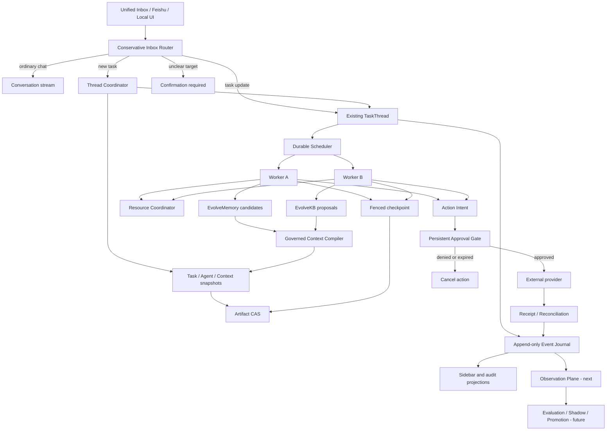

# CoPenguin Runtime Architecture

## Decision

The assistant uses a durable third runtime boundary rather than treating the
Feishu handler, EvolveMemory, or EvolveKB as the orchestrator.

Product validation is deliberately outside that authority boundary. See
[`PRODUCT_EVIDENCE_SPEC.md`](PRODUCT_EVIDENCE_SPEC.md): its consent-filtered
observer can derive research evidence from events, but it cannot mutate Runtime
state or promote memory, knowledge, skills, hooks, or permissions.

Thread identity and history survive worker shutdown. The scheduler can run
different Threads concurrently but prevents two main Runs from the same Thread
from being claimed at the same time.

## Implemented vertical slice

`super_agent_runtime` currently provides:

- immutable event envelopes with stream sequence, global order, correlation,
  and causation fields;
- pure deterministic Thread/Run reducer;
- canonical JSON projection hashing and replay verification;
- SQLite journal and sidebar projection in one transactional commit;
- optimistic revision checks for the Thread single-writer rule;
- durable scheduler queue with worker claim, heartbeat, retry, expiry, and
  fencing token;
- cross-Thread resource leases with shared reads and exclusive writes;
- immutable filesystem Artifact CAS;
- TaskSnapshot, AgentSnapshot, and ContextManifest binding before execution;
- atomic Task submission that creates Thread, Run, snapshot bindings, and the
  scheduler job in one transaction;
- Thread Coordinator claim/start and fenced checkpoint recovery;
- a unified Feishu/local Ingress boundary with durable message identity,
  restart-safe dedupe, normalized message Artifacts, and conservative routing
  between ordinary chat, a new Task, an existing TaskThread, control commands,
  and ambiguous messages requiring confirmation;
- durable action Intent/Receipt records with execution fencing and crash
  reconciliation;
- persistent approval decisions and expiry linked to Action Intent, with
  `NEEDS_APPROVAL` surfaced as Thread attention;
- read-only FastAPI projections for Threads, Inbox routes, Actions, and
  approvals under `/runtime/*`.

SQLite stores the source event stream and disposable materialized projections.
The projection endpoints do not load or replay every conversation, which keeps
the future sidebar responsive when many tasks are dormant.

## Multi-link history

One large chat transcript is not the runtime state. The event journal supports
five projections:

1. Conversation history: user/agent turns.
2. Execution history: Run, Step, tool and verifier activity.
3. Decision history: alternatives, evidence and chosen branch.
4. Artifact history: input/output/evidence lineage.
5. Governance history: approval, policy, memory and evolution decisions.

The views share identifiers and causal links. They can be queried independently
without losing their common history.

## EvolveMemory boundary

EvolveMemory remains the governed personalization control plane. Runtime events
may produce memory observations, but they must enter EvolveMemory as candidates.
Runtime state such as queue position, worker lease, retry count, or current Step
must not become long-term user memory.

When compiling context, the Runtime should record a future
`MemoryPolicySnapshot` plus the identifiers of gated memory items. It should not
copy mutable memory records into Thread state.

## EvolveKB boundary

EvolveKB remains the operational knowledge and skill control plane. Runtime can
execute a selected Playbook or Skill snapshot and retain its trace identifier.
Usage evidence may create a KB proposal, but a worker cannot directly promote
that proposal.

The Runtime will later bind every Run to a `SkillRegistrySnapshot` and
`KBSnapshot` so replay uses the same executable knowledge version.

## Generalized worktree: Action Workspace

Code uses a Git branch/worktree. Other resources need equivalent speculative
workspaces:

| Domain | Staged workspace |
| --- | --- |
| Files | Copy-on-write file overlay |
| Email | Draft and recipient manifest |
| Calendar | Proposed change set with source version |
| Memory | Governed memory candidate |
| Knowledge/Skill | Reviewable proposal snapshot |
| Agent policy | Candidate snapshot plus shadow evaluation |

A staged change becomes real only after version/conflict checks, authorization,
Intent creation, external execution, Receipt recording, and verification.

## Next implementation slices

1. Complete problem interviews and select the narrow pilot workflow. Continue
   Runtime work only where it supports pilot safety, delivery, or measurement.
2. Apply Thread updates, cancellation, and route confirmation semantics
   durably (V2-003).
3. Complete the worker lifecycle with Step events, heartbeat, verifier,
   Delivery, and atomic scheduler/Run completion.
4. Add a versioned Hook Registry for pre-route, pre-context, pre-action,
   post-action, verifier, and exception hooks. Hooks may advise or block but may
   not mutate durable state outside an Intent.
5. Add a self-loop monitor that derives observations from events, detects
   stalls/repeated corrections/policy violations, and opens reviewable
   remediation Tasks.
6. Only after product and runtime gates pass, add candidate, independent evaluation,
   shadow execution, pointer promotion, monitoring, and rollback.
