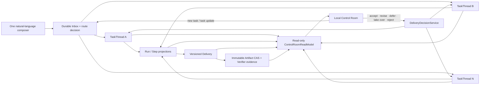

# V2-008 — Local Control Room

Status: implemented and locally test-backed on top of the V2-007 Delivery-decision slice

## Product contract

The Control Room is the local owner surface for understanding parallel work. It
does not replace the durable Runtime and does not create a second source of
truth. Every visible task, status, Run, Step, Artifact, Attention item, and
Delivery decision comes from a Runtime projection or an immutable Artifact.

The primary owner journey is:

```text
describe work once
  -> see which Project and TaskThread owns it
  -> follow each independent Run without mixing histories
  -> open the resulting Artifact and verification evidence
  -> act on the small Attention queue
  -> accept, revise, defer, take over, or reject the Delivery
```

The UI uses plain-language Chinese labels by default. Durable identifiers,
projection hashes, fencing tokens, and raw event payloads remain available to
developers through the Runtime API, but they are not the primary owner
experience.



The arrows into the Control Room are composed reads. The two arrows leaving it
reuse existing durable command boundaries; the browser never patches a
projection directly.

## Information architecture

The desktop surface has four stable regions:

1. **Navigation** — overview, Attention, all tasks, Inbox, and
   Memory & Permissions capability state.
2. **Task rail** — a natural-language composer and Project-grouped TaskThreads.
   Each row shows ownership, plain-language state, last activity, and bounded
   progress without becoming a dashboard card.
3. **Task detail** — objective, Run lineage, Step state, inspectable Artifacts,
   verifier evidence, and versioned Delivery history for exactly one Thread.
4. **Attention rail** — only items requiring owner input, approval, conflict
   resolution, failure handling, or Delivery review.

On narrow screens the regions become routes inside one responsive surface:
task list, selected task detail, and Attention. The Delivery decision controls
remain available without horizontal scrolling.

## Visual system

The accepted concept is a calm arctic control desk, not a terminal or an
enterprise analytics dashboard:

- true white and pale cool-gray/ice-blue content surfaces;
- charcoal navigation, graphite text, and hairline blue-gray borders;
- penguin-beak yellow for the primary owner decision and Attention;
- muted blue for active work, green only for verified/completed state, and red
  only for destructive rejection;
- open rails, lists, dividers, and one elevated Delivery review surface instead
  of nested cards or a bento grid;
- the repository-owned penguin mascot appears only as a compact brand mark;
- 12–15 px control typography, 17–20 px section headings, and a 28–32 px task
  title on desktop;
- consistent thin-outline icons and 10–14 px radii.

The desktop concept is stored outside the repository at:

```text
/Users/zsaotsao/.codex/generated_images/019fc04d-6efa-74a3-b663-3029eb2f2cc4/exec-56710d0e-f639-46df-be33-ec7b282b65da.png
```

The responsive Delivery-revision concept is stored at:

```text
/Users/zsaotsao/.codex/generated_images/019fc04d-6efa-74a3-b663-3029eb2f2cc4/exec-ad7f80f4-de6c-4cba-aee6-4b0a8f55aa89.png
```

These are design references, not raster UI assets. All controls and product
text remain code-native.

## Runtime read model

The Control Room composes existing projections without persisting a UI-owned
state model:

- `ThreadProjection` is the task and concurrency boundary;
- `RunProjection`, `SchedulerJob`, and `StepRecord` explain progress;
- `AttentionState`, proposed Inbox routes, and pending Approvals feed the
  owner queue;
- `DeliveryRecord` and `DeliveryDecisionRecord` govern acceptance;
- Artifact CAS content supplies outcome, evidence, and decision-record preview;
- settings expose capability availability, not permission escalation.

The UI may keep ephemeral selection, filters, expanded panels, and unsent text
in the browser. It must never treat browser storage as Runtime truth.

## Local routes

V2-008 adds a loopback owner surface and composed read endpoints:

```text
GET  /control-room
GET  /control-room/api/overview
GET  /control-room/api/threads/{thread_id}
GET  /control-room/api/artifacts/{artifact_id}
```

Existing durable mutation paths remain authoritative:

```text
POST /runtime/inbox
POST /runtime/deliveries/{delivery_id}/present
POST /runtime/deliveries/{delivery_id}/decision
```

Opening a `PREPARED` Delivery in Task Detail records `PRESENTED` before enabling
decisions. A revision requires bounded owner text and creates a new immutable
Run through V2-007. The browser reuses one idempotency key while retrying the
same decision.

## Trust and privacy boundary

- Every Control Room data route rejects non-loopback clients.
- Static CSS, JavaScript, and the public mascot contain no private Runtime data.
- Artifact preview accepts only a validated CAS reference, verifies the digest,
  applies a bounded preview size, and never resolves an arbitrary filesystem
  path.
- The UI does not publish to Feishu, write Memory or EvolveKB, change a Hook,
  grant permissions, or start self-evolution.
- Memory & Permissions is capability-state disclosure only in V2-008.
- Actor-scoped local sessions, independent Artifact download authorization, and
  explicit non-loopback opt-in remain V2-010.
- Route correction remains V2-009 even though proposed routes are visible in
  Attention.

## Acceptance gate

V2-008 is accepted only when tests and browser evidence prove that:

1. four concurrent Thread states remain visually and causally distinct;
2. selecting a Thread shows only its Runs, Steps, Deliveries, and Artifacts;
3. Attention contains only durable user-action states;
4. an Artifact can be opened as a bounded, digest-verified local preview;
5. a natural-language composer creates a durable new Task without exposing
   command syntax;
6. a `PREPARED` Delivery becomes `PRESENTED` when shown, then all five V2-007
   decisions use the existing idempotent decision service;
7. revision text creates a new snapshot-bound Run and does not replace the old
   Delivery;
8. desktop and mobile layouts have no clipped primary content or horizontal
   overflow;
9. non-loopback Control Room data and mutations fail closed; and
10. the existing Runtime test suite and package/container gates remain green.

## Explicitly deferred

- route correction controls and compensation UI (V2-009);
- local session authentication and scoped Artifact downloads (V2-010);
- Memory candidate review and permission-policy editing (V2-011+);
- real Feishu dispatch, publication Provider, and send Receipt;
- self-loop monitoring, ReviewCases, and autonomous promotion.
