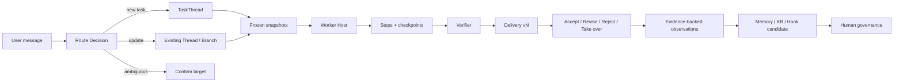
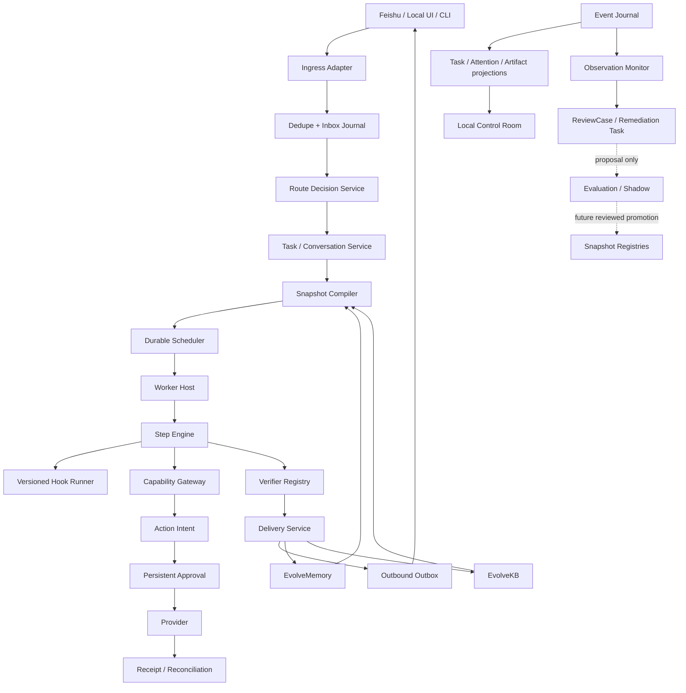

# CoPenguin V2 产品与工程优化方向

状态：提案，等待评审后进入实现

版本主题：**Trusted Closure / 可信闭环**

审计日期：2026-08-12

## 0. 结论先行

CoPenguin 当前最大的优点与最大的问题是同一件事：

> Runtime 的耐久性设计已经明显领先于实际产品路径。

事件日志、Thread/Run replay、scheduler fencing、Artifact CAS、Intent/Receipt、
持久审批等基础原语已经存在；但用户真正使用的飞书和 `/computer` 链路仍经过旧的
`PrivateAssistantAgent + in-memory ApprovalStore`，没有端到端进入这套 Runtime。

因此，V2 不应以“更多工具、更强模型、自动自我进化”为目标，而应完成一条可以实际使用、
可以中断恢复、可以验证结果、可以积累信任的主链：

```text
一条消息
  -> 对话 / 新任务 / 任务更新 / 需要确认
  -> 独立 TaskThread
  -> 可观察的 Run 与 Step
  -> Artifact + Verifier + Delivery
  -> 接受 / 修改 / 拒绝 / 接管
  -> 记忆、知识、Hook 或权限候选项
  -> 人类审核，而不是自动晋升
```

V2 的一句话定位建议是：

> 面向同时处理多个数字项目的 AI-native 个人工作者，CoPenguin 是一个用户拥有的本地执行控制面：它把随手发出的一条消息变成隔离、可恢复的任务，并返回带证据、可决策的交付物。

## 1. 审计范围与证据边界

本提案基于四类证据：

1. 原始 `Super Agent Runtime Specification v0.1` 与开发计划；
2. 当前 CoPenguin 代码、45 项测试、README 和架构协议；
3. EvolveMemory 与 EvolveKB 已定义的治理边界；
4. 当前官方产品与研究资料。

当前仓库没有可操作的完整用户界面，也没有一条真实 Provider 驱动的端到端任务流程。
所以这里可以确认代码和协议事实，但不能声称已经完成真实 UX、留存或产品价值验证。

证据标签：

- **Implemented**：代码和测试均存在；
- **Partial**：基础原语存在，但未进入真实入口或缺少终态；
- **Specified**：文档已定义，尚未实现；
- **Hypothesis**：需要访谈或 Pilot 证明。

## 2. 当前能力盘点

| 领域 | 状态 | 已有资产 | 关键缺口 |
| --- | --- | --- | --- |
| 事件与 replay | Implemented | append-only journal、纯 reducer、projection hash | 缺少 event upcaster、完整迁移和启动时一致性审计 |
| Thread 隔离 | Implemented | Project → TaskThread → Run；同 Thread single-writer | Branch 只有字段，没有 fork/merge/reject 语义 |
| 并发调度 | Partial | queue、claim、heartbeat、retry、lease、fencing | 没有常驻 Worker Host；scheduler 终态未与 Run/Delivery 原子提交 |
| Context 冻结 | Implemented | Task/Agent/Context snapshot + CAS | 实际消息入口没有使用；Memory/KB snapshot 仍是空引用 |
| Inbox 路由 | Partial | 保守路由和持久 route record | 飞书/本地 CLI 绕过；Thread update 没有写入 Thread history；歧义没有产品确认流 |
| 外部动作治理 | Partial | durable Intent/Receipt/reconciliation/Approval | 实际 `/computer` 使用内存审批并直接调用 Provider |
| 交付 | Specified/Partial | `delivery.recorded` 原语 | 没有 verifier、交付版本、用户决定、修改后新 Run 和结果通知 |
| 记忆 | Partial | EvolveMemory adapter | 当前 scope 主要是 `platform:actor`；没有产品层审阅、纠正、忘记和“待推理画像”状态 |
| 知识与技能 | Partial | EvolveKB adapter | Run 未绑定实际 KB/Skill snapshot；使用结果不会形成受治理提案链 |
| Hook | Specified | AgentSnapshot 已预留 `hook_registry_snapshot_id` | 没有 Registry、调用协议、失败策略、trace 和权限边界 |
| Self-loop | Specified | event journal 可作为观察源 | 没有 detector、ReviewCase、冷却、升级或人工处置流 |
| 自我进化 | Future | 已有候选/影子/晋升/回滚概念 | 没有独立评估平面；V2 不应开放自动晋升 |
| 产品验证 | Specified | 访谈、Pilot、Product Evidence 协议 | 尚无用户行为数据，不能称为 PMF 或留存验证 |

## 3. 产品经理视角：目前存在的问题

### P0-1：产品承诺与当前体验不一致

README 描述的是持久任务、并发执行、可检查交付和安全动作；实际普通消息只得到一条通用回复，
`/computer` 使用另一套内存审批。用户看不到 TaskThread、Run、Artifact、Attention 或 Receipt。

影响：

- 用户无法感知 Runtime 的核心价值；
- 架构正确性无法转化为可用性和信任；
- Pilot 即使开始，也无法收集“真实闭环任务”证据。

V2 决策：所有本地与飞书消息必须先进入同一个 `Ingress -> InboxCoordinator` 主链。

### P0-2：目标用户明确，但首个必胜任务仍然过宽

“跨生活和工作的通用助理”是长期愿景，不是 V2 的激活场景。当前同时列出项目恢复、
source-to-artifact 和周复盘三类 Pilot 工作流，但没有一个被指定为默认 Golden Path。

V2 建议默认选择：**Source to Inspectable Artifact**。

示例：

- 一组资料 → 有来源的分析或决策文档；
- 一个仓库 → 可评审的改动与 PR；
- 一组会议/项目材料 → 带未决事项的周报。

选择理由：

- 输出可见、可比较、可接受或拒绝；
- 不依赖高风险外部动作；
- 与 AI-native 多项目用户的现有行为接近；
- 可以自然验证 Thread 隔离、恢复、Artifact、Verifier 和交付决定。

这只是 Alpha 默认项。若问题访谈的真实证据反对它，应更换工作流，而不是修改证据门槛。

### P0-3：没有定义“交付完成”的用户语义

当前有 scheduler completed、Run completed 和 `delivery.recorded`，但没有回答：

- 用户看到什么才算交付？
- 产物在哪里打开？
- 哪些证据证明任务被正确完成？
- 用户怎样接受、要求修改、拒绝、延后或自行接管？
- 修改是覆盖旧结果，还是创建新 Run/Delivery？

V2 交付卡必须固定包含：

| 区块 | 内容 |
| --- | --- |
| Outcome | 一句话说明完成了什么 |
| Artifacts | 可打开、可导出、有版本的产物 |
| Evidence | 来源、Verifier 结果、外部 Receipt |
| Decisions | 关键假设和取舍，不展示冗长思维链 |
| Changes | 与上一版 Delivery 的差异 |
| Next decision | `接受`、`修改`、`拒绝`、`接管`、必要时 `批准动作` |

`Delivery` 是版本化实体。要求修改时创建新的 Run 和 Delivery，旧交付不可被覆盖。

### P0-4：单聊天框没有对应的任务纠错体验

保守路由器已经能识别“继续”“换个方式”等信号，但实际产品没有展示：

- 消息被归到哪个 TaskThread；
- 为什么判断为新任务或任务更新；
- 歧义时有哪些候选 Thread；
- 用户如何一键改正；
- 改正后旧路线怎样留痕。

V2 需要一个轻量 Route Decision：

```text
已归入：CoPenguin V2 方案
判断：继续当前任务，并开启“方案 B”分支
[正确] [改为新任务] [选择其他 Thread]
```

高置信度决定可以先执行可逆准备工作；不明确的 continuation 不得启动 Worker。

### P1-1：没有首次价值路径

当前安装后需要用户理解命令、环境变量、飞书配置和 Runtime 概念。没有一个 10-15 分钟内
完成首个可接受交付的 onboarding。

V2 激活路径：

1. 本地启动后只问用户选择一个真实资料或仓库；
2. 用户用自然语言描述一个熟悉的结果；
3. 系统显示它理解的 TaskThread 边界和验收标准；
4. 执行一个只读/可逆 Run；
5. 返回交付卡；
6. 用户必须明确接受、修改或拒绝。

激活不是“发出第一条消息”，而是“完成第一条被接受的闭环任务”。

### P1-2：继续使用的驱动力仍停留在假设层

用户不应该因为企鹅、陪伴话术、连续签到或通知焦虑而回来。合理的复用动力是：

```text
第二次同类任务
  -> 更少重复解释
  -> 更正确的 Context
  -> 更快到达可接受交付
  -> 用户主动扩大一个有边界的权限
```

V2 必须直接展示这种复利：例如“本次复用了你已确认的 3 条偏好和 1 个 Playbook，
比第一次少问了 2 个问题”。该说明必须由 trace 产生，不能是模型编造。

### P1-3：通用 Agent 的产品信息架构缺失

一个聊天框适合输入，不适合管理并发、等待、失败和交付。V2 建议用本地 Control Room
补全控制面，而不是立刻建设一个大型新客户端：

1. **Inbox**：统一输入与 Route Decision；
2. **TaskThreads**：按 Project 隔离的任务侧栏；
3. **Attention**：只放需要输入、审批、冲突、失败和待验收交付；
4. **Task Detail**：目标、当前状态、Run/Step、决策、Artifact 与 Receipt；
5. **Memory & Permissions**：记住了什么、为什么使用、当前能力级别和过期时间。

飞书仍可以是输入与通知入口，但不能成为唯一的状态浏览器。

### P1-4：市场位置已经变化

到 2026 年中，通用平台已经开始提供长时任务、跨应用工作、Scheduled Tasks、项目记忆、
审批和可观察进度。CoPenguin 不能再把“Agent 能做长任务”或“有项目/记忆”当作差异化。

V2 应强调四项更难被平台默认能力替代的价值：

- 本地拥有、可迁移的任务和 Artifact 历史；
- Provider 无关的执行控制面；
- 可重放的状态、Intent/Receipt 与崩溃对账；
- 按 Project/Domain/Capability 管理的记忆和权限治理。

因此，CoPenguin 更像 **Personal Agent Control Plane**，而不是另一个聊天机器人。

## 4. 高级开发视角：目前存在的问题

### P0-1：存在两套事实源与两套审批系统

实际路径：

```text
Feishu -> PrivateAssistantAgent -> in-memory ApprovalStore -> ComputerProvider
```

目标路径：

```text
Ingress -> InboxCoordinator -> TaskThread -> Worker
        -> ActionIntent -> durable Approval -> Provider -> Receipt
```

这不是普通技术债，而是安全边界失效：进程重启会丢失当前产品路径的待审批项，Provider
执行也不会留下 Runtime Intent/Receipt。

V2 必须删除产品路径对 `ApprovalStore` 的依赖；兼容层可以暂时存在，但不得执行真实动作。

### P0-2：Runtime 原语没有执行宿主

仓库有 `claim_next_run`、heartbeat、checkpoint 和 finish 方法，但没有常驻 Worker Host：

- 没有从 queue 拉取 Run 的服务循环；
- 没有 Planner/Executor 协议；
- 没有 Step 生命周期；
- 没有工具调用 trace；
- 没有取消、预算和超时传递；
- 没有 Provider 故障后统一恢复策略。

V2 需要一个很小但真实的 `WorkerHost`，第一版只支持一个 Golden Workflow 和可插拔
`ModelProvider`/`CapabilityProvider`，不需要先做“无限通用 Agent loop”。

### P0-3：scheduler 终态与 Thread/Run/Delivery 可能分裂

`finish_run_claim()` 更新 scheduler job；Run 状态、Thread 状态、Delivery 和 Attention 由其他
调用分别更新。进程可能在其中任意两步之间崩溃，造成：

- job 已 completed，但 Run 仍 running；
- Run completed，但 Delivery 不存在；
- Delivery 已记录，但用户没有收到通知；
- Thread 卡在 RUNNING 或没有 `DELIVERY_READY`。

V2 需要一个 `finalize_run()` 事务，同时提交：

1. VerifierResult Artifact；
2. Delivery vN；
3. Run terminal state；
4. Thread state 与 Attention；
5. scheduler terminal state；
6. notification outbox item。

### P0-4：真实 Ingress 缺少端到端幂等与 Outbox

Runtime inbox 表可以按 `platform:message_id` 幂等，但飞书 Webhook 实际路径没有先写入它。
Webhook 重试可能重复创建内存审批或重复调用 Provider。发送回复也没有 transactional outbox，
进程在“提交状态”和“发送消息”之间崩溃时会漏发或重发。

V2 应实现：

```text
Inbound dedupe -> durable route/task transaction
                  -> outbound outbox
                  -> channel dispatcher with idempotency key
```

### P0-5：当前 Runtime API 只有读取，且没有认证

`/runtime/*` 会返回 Task title、metadata、动作和审批信息。默认绑定 loopback 时风险可控；
一旦用户配置为局域网或隧道地址，就没有认证和 scope 控制。

V2 默认要求：

- Control Room 只绑定 loopback；
- 使用本地 session token；
- Artifact 下载独立鉴权；
- 非 loopback 启动必须显式 opt-in；
- 飞书回调与 Control Room API 使用不同安全边界。

### P1-1：Inbox update 没有真正更新 TaskThread

`THREAD_UPDATE` 当前只保存 inbox route record，不会追加用户消息、修改 TaskSnapshot、创建新
Run 或 Branch。普通 chat 也没有自己的持久 conversation stream。

V2 需要明确语义：

- 补充信息：追加 `thread.message_appended`，必要时重新编译下一 Run 的 Context；
- 改验收标准：生成新的 TaskSnapshot，仅对新 Run 生效；
- “换个方式”：创建 Branch，保留原方案和决策原因；
- “停止/取消”：修改 desired state 并向 Worker 传播 cancellation；
- 普通对话：写 conversation stream，但不创建 TaskThread。

### P1-2：Branch 只有 ID，没有分支历史

当前 `branch_id` 参与事件字段，但缺少：

- `thread.branch_forked`；
- `forked_from_event_id`；
- `base_snapshot_hash`；
- 分支状态与选择理由；
- 分支淘汰/合并事件。

“不如换个方式”不应该擦除人的工作痕迹。V2 用 Branch 表达方法变更，用新 Run 表达重试。

### P1-3：记忆 Scope 还不足以支撑工作与生活通用性

当前 adapter 使用 `platform:actor` 作为 session，产品层看不到 Project、Domain、Thread 和
敏感级别。V2 不应在“抽象画像”与“分门别类”之间二选一，而应采用：

> 一个规范化 Memory Claim + 多维 facet + 按用途生成 projection。

建议字段：

| 维度 | 取值示例 |
| --- | --- |
| Kind | ProfileFact、Preference、Relationship、Event、Commitment、WorkflowEvidence、Hypothesis |
| Subject | user、person、project、domain、thread |
| Scope | global、domain、project、thread |
| Epistemic state | observed、inferred_candidate、user_confirmed、corrected、rejected、expired |
| Allowed use | direct、style、follow-up、review-only、prohibited |
| Governance | provenance、confidence、sensitivity、expiry、supersedes |

“待推理画像”属于 `Hypothesis + inferred_candidate`，必须积累独立证据并由用户确认，不能直接
进入 prompt。任务队列、Worker lease、retry 次数等 Runtime 状态永远不是长期记忆。

### P1-4：Hook 必须是可治理协议，不是任意 callback

如果 Hook 能直接写数据库或调用外部工具，它会绕开 event sourcing 和 Intent/Receipt。

V2 Hook Registry 必须版本化并绑定到 AgentSnapshot。每个 Hook 至少包含：

- `hook_id`、`version`、`phase`、`priority`；
- 输入/输出 schema；
- timeout 与 failure policy；
- 所需 capability 与数据 sensitivity；
- deterministic / replay-safe 声明；
- source Artifact 与签名/hash。

允许输出：

- `Advice`：建议，不改变 durable state；
- `Veto`：阻止当前阶段并给出 reason code；
- `ContextPatchProposal`：在 snapshot 冻结前提出上下文变更；
- `IntentProposal`：请求 Runtime 创建受治理动作；
- `Observation`：供 self-loop 观察器消费。

禁止输出：直接数据库写、直接 Provider 调用、无 Intent 的权限变更、自动晋升自身版本。

推荐 phase：

```text
pre_route -> post_route -> pre_context -> post_context
-> pre_plan -> pre_step -> pre_action -> post_action
-> pre_verify -> post_delivery -> on_exception
```

### P1-5：Self-loop 的触发条件尚未工程化

Self-loop 不应该定时问模型“我还能怎么改进”。触发器必须来自可解释的运行证据：

| 触发类型 | 示例 | 默认处置 |
| --- | --- | --- |
| 状态触发 | Run stall、等待超时、unreconciled Intent | 打开 ReviewCase 或安全暂停 |
| 行为触发 | 连续 route correction、反复解释同一约束、manual takeover | 提出 Context/Playbook 候选 |
| 质量触发 | 相同 verifier failure 重复出现 | 创建 remediation Task |
| 权限触发 | 多次拒绝审批、主动降级权限 | 建议收紧 policy，不得劝说升级 |
| 语义触发 | “换个方式”“这个结果不能用” | 保留旧链，创建 Branch/新 Run |
| 安全触发 | 跨 Thread context、未授权动作、预算越界 | quarantine + 人工审查 |

隐含语义只能产生带 evidence IDs、confidence 和 reason code 的 `CorrectionSignal`；低置信度
信号只能进入 ReviewCase，不能自动改变 Memory、Skill、Hook 或权限。

这里可以借鉴工业管理：

- **Andon**：异常时停止并让问题可见；
- **WIP limit**：限制并发而不是无限开任务；
- **PDCA**：计划、执行、检查、经审核后调整；
- **CAPA**：区分修复本次任务与预防重复问题；
- **double-loop learning**：必要时审查规则本身，但仍需要独立证据。

### P1-6：持久化、隐私和演进仍未达到长期私人助理要求

当前 SQLite 与 Artifact CAS 是明文存储，没有产品级：

- event schema upcaster；
- 每版本独立 migration 与 rollback/backup；
- Artifact metadata index、retention 和垃圾回收；
- 加密、导出、删除与恢复演练；
- 启动时 integrity/replay audit；
- 数据规模 benchmark。

V2 至少需要“可备份、可导出、可删除、可验证恢复”。加密 at rest 可作为 V2.1，但目录权限、
敏感 Artifact 分类和非 loopback 防护不能再延后。

### P1-7：安全策略和能力状态仍然过度依赖“调用者做对”

当前 durable Approval 保存了 `resolved_by`，但 repository 不判断这个 actor 是否有权批准；
实际命令链也没有把审批限定到请求者、owner role、Project 或 capability policy。对于只有一个
owner 的本地实验尚可接受，一旦 allowlist 有多个成员，就存在跨任务批准风险。

另外：

- 未配置飞书 verification token 时，parser 不会自行拒绝远程 payload；
- snapshot、Delivery 和部分 Artifact 参数只检查 ID 格式，不验证对象存在和 schema；
- EvolveMemory/EvolveKB 不可用时会退化为 No-op，但用户缺少明确能力状态提示；
- regex 风险分类无法表达 capability、参数、资源、domain、actor 和 policy scope；
- `local-shell` 继承宿主环境，单独的 executable allowlist 不能替代参数和目录策略。

V2 应增加 `CapabilityPolicyService` 与 startup configuration validation：Provider、Memory、KB、
审批人、Artifact 和远程入口的真实状态必须在健康页和每个 Run snapshot 中可见；关键配置缺失
应 fail closed，而不是静默变成另一种产品行为。

### P2：代码组织已经接近维护临界点

`SQLiteRuntimeRepository` 当前约 2,800 行，同时负责 migration、事件、projection、scheduler、
resource、inbox、approval 和 action。继续加入 Step、Delivery、Hook、Observation 会形成高风险
单体类。

建议保留一个数据库事务边界，但拆分为：

```text
RuntimeUnitOfWork
  EventJournal
  ThreadStore
  SchedulerStore
  ActionStore
  ApprovalStore
  InboxStore
  DeliveryStore
  ObservationStore
```

拆分目标是所有权清晰和可测试性，不是引入微服务。

## 5. V2 目标产品契约

### 5.1 用户对象模型

```text
Project
  └─ TaskThread        稳定目标和侧栏身份
      ├─ Branch        方法或方案分支
      │   └─ Run       一次执行尝试
      │       ├─ Step  模型、工具或验证操作
      │       └─ Artifact
      └─ Delivery vN   可验收结果
```

Chat message 是输入，不等于 Task。TaskThread 是承诺，不等于一次执行。Run 是尝试，不等于
交付。Delivery 是可验收结果，不等于用户已经接受。

### 5.2 V2 Golden Path



### 5.3 Attention 规则

Attention 不是状态日志，而是用户的决策队列。只允许：

- `NEEDS_INPUT`；
- `NEEDS_APPROVAL`；
- `HAS_CONFLICT`；
- `DELIVERY_READY`；
- `FAILED`；
- `REVIEW_REQUIRED`（V2 新增）。

“正在运行”不进入 Attention。通知只在 Attention 从无到有、严重级别提升或等待即将过期时发送。

### 5.4 自治等级

| 等级 | 能力 | V2 策略 |
| --- | --- | --- |
| L0 Suggest | 只建议 | 默认可用 |
| L1 Draft | 创建可逆 Artifact | Golden Path 默认 |
| L2 Ask-to-run | 准备动作，执行前审批 | 仅低风险能力和持久审批 |
| L3 Bounded auto-run | 在 scope/budget/expiry 内自动执行 | V2 不开放；只设计 policy schema |

## 6. V2 Runtime 目标架构



详细工程契约见 [V2 Runtime Contract](V2_RUNTIME_CONTRACT.md)。

## 7. V2 优先级与实现切片

### Milestone A：Converge / 统一主链

| PR | 目标 | 验收 |
| --- | --- | --- |
| V2-001 | Ingress adapter + inbound dedupe | 同一飞书/本地 message 在重启与重试后只产生一次 route |
| V2-002 | 移除产品路径内存审批 | `/approve` 操作 durable Approval，重启后仍存在 |
| V2-003 | Thread update 与 confirmation | 补充、改目标、换方案、取消都有持久事件和正确语义 |

### Milestone B：Close / 完成交付闭环

| PR | 目标 | 验收 |
| --- | --- | --- |
| V2-004 | Worker Host + Executor Protocol | 至少一个 source-to-artifact workflow 可从 queue 自动完成 |
| V2-005 | Step + Verifier | 每个模型/工具/验证操作有状态、Artifact 与 causal trace |
| V2-006 | 原子 `finalize_run` | scheduler、Run、Thread、Delivery、Attention 和 outbox 无分裂终态 |
| V2-007 | Delivery decision | accept/revise/reject/defer/takeover 可持久、可 replay；revise 创建新 Run |

### Milestone C：Control / 让用户可管理

| PR | 目标 | 验收 |
| --- | --- | --- |
| V2-008 | 本地 Control Room | 可查看 TaskThreads、Attention、Run/Step、Artifacts、Approvals |
| V2-009 | Route/Delivery 决策 UI | 用户可纠正路由并对交付做明确决定 |
| V2-010 | Auth + Artifact access | loopback token、独立下载授权、非 loopback 显式 opt-in |

### Milestone D：Learn Safely / 受治理学习

| PR | 目标 | 验收 |
| --- | --- | --- |
| V2-011 | Memory Scope Contract | Run 可列出使用过的 Memory IDs、allowed-use 与 scope；候选可审阅 |
| V2-012 | Hook Registry | 版本化、snapshot-bound、超时/失败策略、完整 trace、无直接外部副作用 |
| V2-013 | Observation Monitor | 只从 event 推导信号，输出 ReviewCase；写权限测试证明不能改 Runtime |
| V2-014 | Minimal Product Evidence | 只实现所选 Pilot 必需事件，支持 consent/export/delete/replay |

### Milestone E：Harden / 故障与恢复

| PR | 目标 | 验收 |
| --- | --- | --- |
| V2-015 | Crash matrix + chaos | 入口、Step、Provider、Receipt、Delivery、outbox 每个故障点都有恢复测试 |
| V2-016 | Backup/export/delete | 新设备恢复后 replay hash 一致，删除有 Receipt |
| V2-017 | Repository 模块化 | 不改变 schema 语义，拆分 store 并保留原子 UnitOfWork |

## 8. V2 Definition of Done

V2 只有同时满足产品闭环和 Runtime 闭环才算完成。

### 产品闭环

- 用户能在不理解命令语法的情况下提交一个真实任务；
- 路由结果可见、可纠正，歧义不会静默开工；
- 多个 TaskThread 能并行且不会混淆 Artifact/Context；
- 用户能看到当前状态、需要自己的决定和最终 Artifact；
- 每个 Delivery 都能接受、修改、拒绝或接管；
- 第二次同类任务可以说明复用了哪些已确认信息；
- 产品不使用时长、消息数、情感依赖或焦虑通知作为成功指标。

### Runtime 闭环

- 所有真实入口使用同一 Event Journal 与 durable Approval；
- 每个 Run 固定 Task/Agent/Context/Policy/Hook snapshot；
- Step、Verifier、Delivery 与 scheduler 终态可 replay；
- 外部副作用严格保留 `Intent -> Claim -> Provider -> Receipt`；
- 崩溃不会造成重复外部动作或静默丢失交付；
- Hook 与 Observer 无权绕过 Intent 或自动晋升；
- 备份恢复后 projection hash 一致；
- Control Room API 和 Artifact 有本地认证边界。

### Alpha 产品门槛

- 首个被接受的 Golden Path 交付能在 15 分钟内完成；
- 12 位 Pilot 用户中至少 9 位在 48 小时内完成首个闭环；
- 相同 workflow 的第二次任务，中位澄清+修改负担比第一次下降至少 30%；
- 没有未审批外部动作、跨 Thread Context 泄漏或未对账 Intent；
- 是否继续 V3 由 Pilot 的 proceed/narrow/repeat/stop 决策决定。

## 9. V2 明确不做

- 不做无限制的“自动自我进化”；
- 不让 self-loop 直接修改 prompt、Skill、Hook、Memory 或权限；
- 不同时接入大量消息渠道和 Provider；
- 不先做高风险真实 computer control；
- 不把陪伴、人格依赖或通知打开率作为增长机制；
- 不在 Golden Path 验证前做广泛消费者 onboarding；
- 不用更复杂的多 Agent 拓扑替代尚未完成的单任务闭环。

## 10. 风险登记

| 风险 | 早期信号 | 缓解 |
| --- | --- | --- |
| 架构继续领先产品 | 新增很多 event，但用户仍看不到 Delivery | 每个 Runtime PR 必须对应 Golden Path 验收 |
| 路由错误破坏信任 | route correction 持续高 | 显示路线、确认歧义、保留 correction evidence |
| 审批疲劳 | 大量 deny/expire、用户直接接管 | capability/domain policy、合并低风险审批、默认过期 |
| 记忆越界 | 用户反复纠正或关闭记忆 | scope + allowed-use + provenance + review-only hypothesis |
| Self-loop 噪声 | ReviewCase 过多、重复、不可行动 | detector budget、cooldown、dedupe、severity gate |
| 本地运维过重 | 用户需频繁修数据库/服务 | 单进程默认、健康检查、备份恢复、可诊断错误 |
| 平台竞争同质化 | 用户认为 ChatGPT Work 已足够 | 聚焦本地控制权、可重放恢复、Provider 可迁移和治理证据 |

## 11. 外部资料带来的 V2 修正

- [Anthropic labor market impacts](https://www.anthropic.com/research/labor-market-impacts)
  同时使用理论能力和真实使用覆盖度，并强调早期就业影响证据有限。对 CoPenguin 的启示是：
  不能从模型“能做”推导用户“会持续委托”。
- [ChatGPT Work](https://openai.com/index/chatgpt-for-your-most-ambitious-work/)
  已把跨应用、长时执行、成品交付、进度跟随、改向和审批带入通用产品。CoPenguin 的差异化
  必须转向用户拥有的状态、恢复与治理。
- [ChatGPT Projects](https://openai.com/academy/projects/)、
  [Scheduled Tasks](https://help.openai.com/en/articles/10291617-tasks-inchatgpt) 和
  [ChatGPT Memory](https://openai.com/index/chatgpt-memory-dreaming/)
  说明 Project scope、后台任务、可见记忆和持续上下文已成为用户预期，而不是独特卖点。
- [Claude Managed Agent sessions](https://platform.claude.com/docs/en/managed-agents/sessions) 与
  [event stream](https://platform.claude.com/docs/en/managed-agents/events-and-streaming)
  进一步验证了“版本化 Agent + Session state machine + persistent events + budget + observability”
  正在成为基础平台能力。CoPenguin 应保持 Provider-independent，而不是复制某一家模型平台。

此前提供的 X 链接仍无法稳定读取，因此不作为本提案的事实证据。

## 12. 建议决策

建议批准以下产品和工程决策：

1. 将 V2 主题定为 **Trusted Closure**，而不是 Self-Evolution；
2. 以 **Source to Inspectable Artifact** 作为 Alpha Golden Path；
3. 优先完成真实入口、持久审批、Worker/Step/Delivery 和用户交付决定；
4. 用轻量本地 Control Room 管理 TaskThreads、Attention 与 Artifacts；
5. 采用“规范化 Memory Claim + 多维 facet”的记忆模型；
6. Hook 只能 advise/veto/propose/observe，不能直接写状态或执行动作；
7. Self-loop 在 V2 只打开 ReviewCase 和 remediation proposal；
8. 自动晋升与 L3 自治继续保持关闭，直到 Pilot 与独立评估门通过。

若这些决策通过，实施应从 `V2-001 -> V2-007` 开始；这七个切片完成后，CoPenguin 才第一次
拥有一个真实、持久、可验收的产品闭环。
